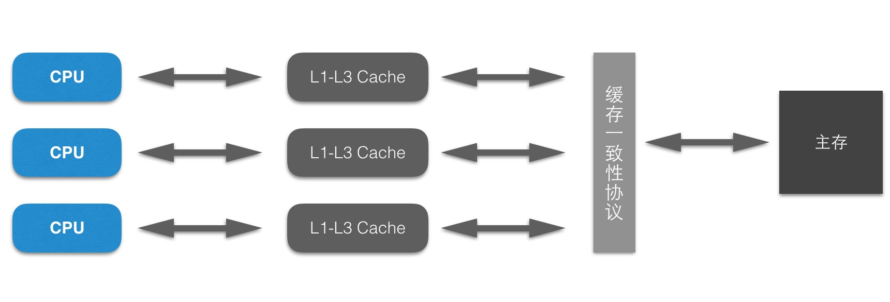
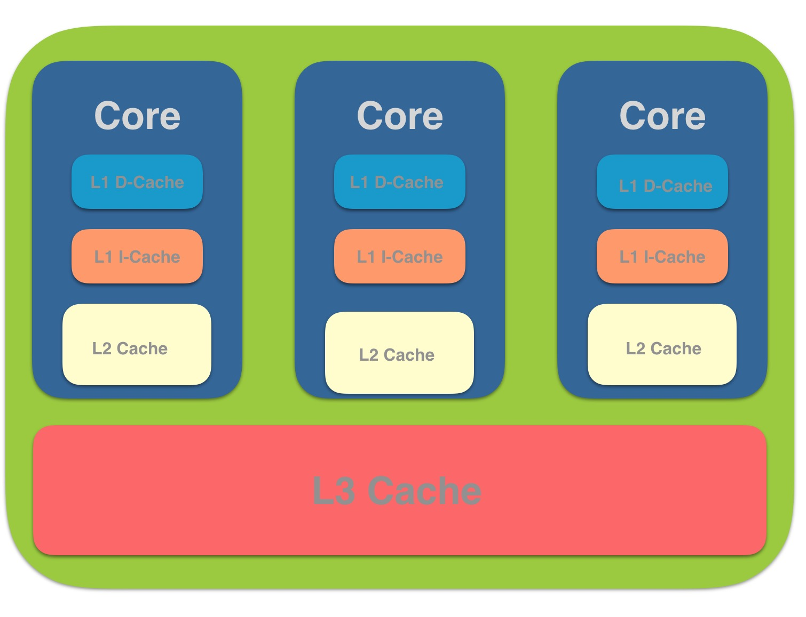
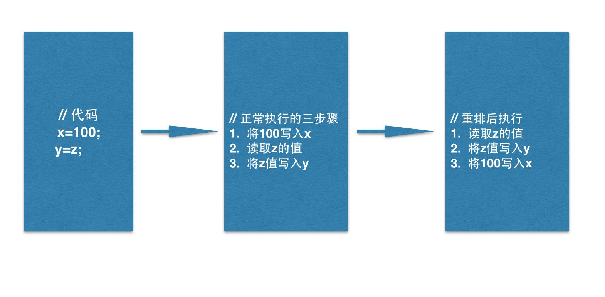

# CPU性能优化

## 概念
为了提高程序运行的性能,现代CPU在很多方面对程序进行了优化。例如:CPU高速缓存,尽可能地避免处理器访问主内存的时间开销,处理器大多会利用缓存(Cache)以提高性能。

如下几种方式就是对CPU性能的优化手段。

## 多级缓存

* L1 Cache(一级缓存): cpu第一级缓存,分为数据缓存和指令缓存。一般服务器CPU的L1缓存的容量通常为32~4096KB。
* L2 Cache(二级缓存): 由于L1级高速缓存容量的限制,为了再次提高CPU的运算速度,在CPU外部放置一高速缓存器,即二级缓存。
* L3 Cache(三级缓存): L3现在都是内置的。而它的实际作用即是,L3缓存的应用可以进一步降低内存延迟,同时提升大数据量计算处理器的性能。具有较大L3缓存的处理器提供更有效的文件系统缓存行为及较短消息和处理器队列长度。一般是多级共享一个L3缓存。

CPU 在读取数据时,先从L1种读取,再从L2读取,再从L3读取,然后是内存,再后是外部存储器。

### MESI(缓存同步协议)
多CPU读取同样的数据进行缓存,进行不同运算之后,最终写入主存以哪个CPU为准?

在这种高速缓存回写场景下,有一个缓存一致性协议,多数CPU厂商对它进行了实现。MESI协议,它规定每条缓存有个状态位,同时定义了以下四个状态。

* 修改态(Modified): 当前Cache行已经被修改过(脏行),内容已不同于主存,为此Cache专有。
* 专有态(Exclusive): 当前Cache行内容和主存相同,但不出现于其它Cache中。
* 共享态(Shared): 当前Cache行内容同于主存,但也出现于其它Cache中。
* 无效态(Invalid): 当前Cache行内容无效(空行)。

多处理器时, 单个CPU对缓存中的数据进行了修改,需要通知其它CPU。也就意味着,CPU处理器要控制自己的读写操作,还要监听其它CPU发出的通知,从而保证最终一致性。

### CPU运行时指令重排

当CPU写缓存时发现缓存区块正在被其它CPU占用,为了提高CPU处理性能,可以将后面的读缓存命令优先执行。并非随机重排,需要遵循As-if-serial语义。

As-if-serial: 不管怎么重排序(编译器和处理器为了提高并行度),(单线程)程序的执行结果不能被改变.编译器,runtime和处理器都必须遵循as-if-serial语义。编译器和处理器不会对存在数据依赖关系的操作重新排序。

### 存在问题

* CPU高速缓存存在问题
缓存中的数据与主存的数据并不是实时同步的,各CPU(或CPU核心)间缓存的数据也不是实时同步的。在同一个时间点,各CPU所看到的同一内存地址的数据的值可能不是一致的。

* CPU执行指令重排序优化存在问题
虽然遵循as-if-serial语义,单仅在单CPU自己执行的情况下能保证结果正确。多核线程中,指令逻辑无法分辨因果关联,可能出现乱序执行,导致程序运行结果错误。

### 内存屏障
处理器提供了两个内存屏障质量(Memory Barrier)用于解决上述两个问题。

* 写内存屏障(Store Memory Barrier)
在指令后插入Store Barrier,能让写入缓存中的最新数据更新写入主存,让其它线程可见。强制写入主存,CPU就不会因为性能考虑而去对指令重排。

* 读内存屏障(Load Memory Barrier)
在指令前插入Load Barrier,可以让高速缓存中的数据实效,强制从新主存加载数据。强制读取主存内容,让CPU缓存与主存保持一致,避免了缓存导致的一致性问题。

