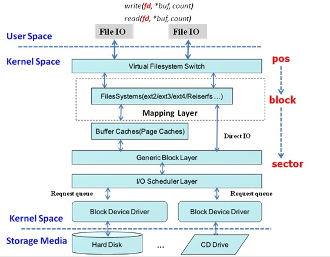

# I/O

## Linux I/O架构

&nbsp;

### 文件系统block与磁盘sector关系

* Block(块)： 文件系统上的概念，一般文件系统block大小为4KB。
* Sector(扇区)：HDD磁盘最小单元，一般为512字节。

Block(块)一般与Sector(扇区)值是不相等的。

&nbsp;

### 磁盘缓存

在Linux系统中，磁盘读写都是有缓存的，因为这种缓存往往有利于系统的读写加速，毕竟我们大部分场景下遇到的都是多读少写，因此，用暂时用不到的内存来当缓存，空间换时间是非常值得的。

缓存的作用原理是，当你读了一个文件，Linux 会先检查内存中的缓存有没有对应的内容，没有才会去读磁盘上的内容，然后会先将磁盘上的内存读到内存中，再返回给用户。这样，下一次读的时候，就不用再次从磁盘中读了，这样就会大大减少文件读的时间。

如果你这时候往这个文件中写了新的内容，Linux 会往缓存中写，而不是直接往磁盘里写，这样，你写文件的时间就会大大减少。只是，写过的缓存会被 Linux 标记为脏了，也就是所谓的内存脏页，Linux 会周期性地收集所有内存脏页，排序整理，然后往磁盘中真正写入，这就是所谓的回写（writeback），也可以叫做刷盘。
