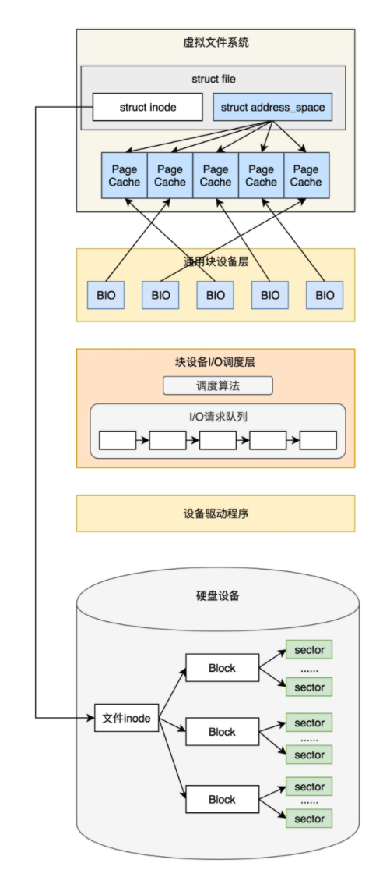
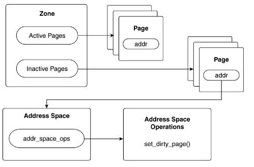
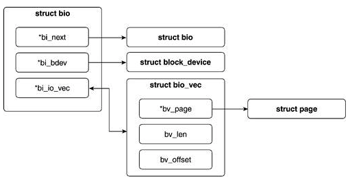
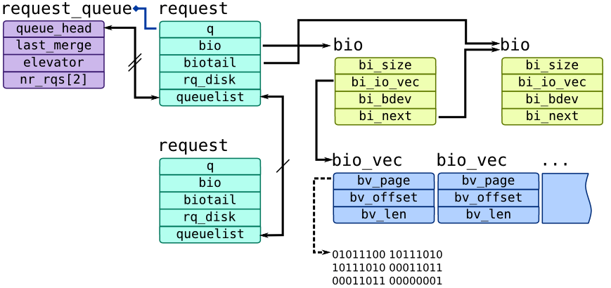
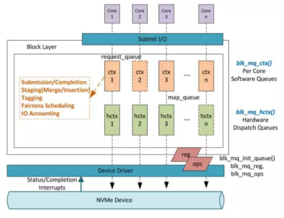
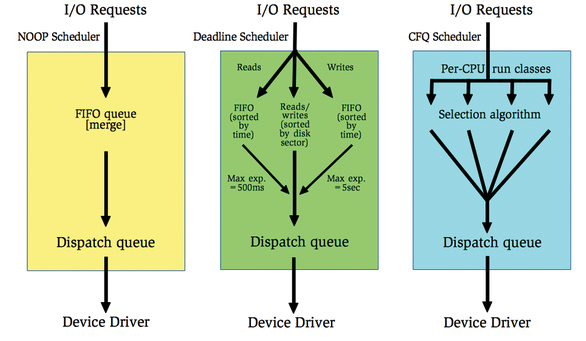
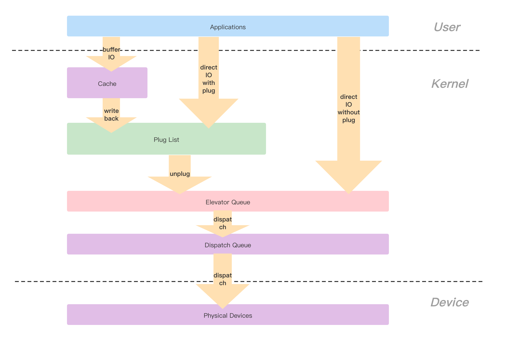

# Block Layer(块层)

对内核来说，管理块设备要比管理字符设备复杂得多。因为块设备访问时，需要在介质的不同区间前后移动，而字符设备访问时仅仅需要控制一个位置，就是当前位置。所以内核没有提供一个专门的子系统来管理字符设备，但是却有一个专门的子系统来管理块设备。这不仅仅是因为块设备的复杂度远远高于字符设备，更重要的原因是块设备的访问性能对系统的影响很大，对硬盘每多一分利用都会对系统的整体性能带来提升，其效果要远远比提高键盘的吞吐速度好得多。

块设备上的操作涉及内核中的多个组成部分，内核块设备IO流程图:



&nbsp;

## I/O 请求流程 

### VFS(虚拟文件系统)

系统调用 `read()` 触发相应的虚拟文件系统函数，虚拟文件系统判断请求的数据是否已经在内核缓存区中(Page cache)，如果不在，则判断如何执行读操作。



&nbsp;

### 文件系统

如果内核必须从块设备上读取数据，就必须要确定数据在物理设备上的位置。这由映射层(Mapping Layer)，即磁盘文件系统来完成。文件系统将文件访问映射为设备访问。

&nbsp;

### 通用块层(Generic Block Layer)

Block: 而如何维持一个I/O请求在上层文件系统与底层物理磁盘之间的关系是由通用块层(Generic Block Layer)来负责的。在通用块层中，使用bio结构体来描述一个I/O请求。

```C
struct bio_vec {
    struct page *bv_page;
    unsigned int bv_len;
    unsigned int bv_offset;
}
```

&nbsp;

#### bio与request

##### bio

`bio` 与 `request` 是块层最核心的两个数据结构。其中，`bio` 描述了磁盘里要真实操作的位置与 `Page Cache` 中页的映射关系。作为Linux I/O请求的基本单元，`bio` 结构贯穿块层对I/O请求处理的始终。

每个 `bio` 对应磁盘里面一块连续的位置(这是由磁盘的物理特性决定的，单次I/O只能操作一块连续的磁盘空间，但是一个 `bio` 请求要读或写的数据在内存上可以不连续，每个不连续的数据段由 `bio_vec` 来描述), 每一块磁盘里面连续的位置，可能对应Page Cache的多页或一页，所以磁盘里面会有一个 `struct bio_vec * bi_io_vec` 的表。



`bio_vec` 就是一个 `bio` 的数据容器，专门用来保存bio的数据。`bio_vec` 是组成 `bio` 数据的最小单位，它包含一块数据所在的页，以及页内的偏移及长度信息，通过这些信息就可以很清晰地描述数据具体位于什么位置。

`bio_idx` 指向当前的 `bio_vec`，通过它可以跟踪I/O操作的完成进度。但`bio_idx`更重要的作用在于对 `bio` 结构体进行分割，像磁盘阵列这样的驱动器可以把单独的 `bio` 结构体（原本是为单个设备使用准备的）分割到磁盘阵列中的各个硬盘上，磁盘阵列设备驱动只需复制这个`bio` 结构体，再把`bio_idx`域设置为每个独立硬盘操作时需要的位置就可以了。

&nbsp;

##### request

`request` 用来描述单次I/O请求，`request_queue` 用来描述与设备相关的请求队列，每个块设备在块层都有一个 `request_queue` 与之对应，所有对该块设备的I/O请求最后都会流经 `request_queue`。块层正是借助`bio`、`bio_vec`、`request`、`request_queue` 这几个结构将I/O请求在内核I/O子系统各个层次的处理过程联系起来的。



面对新的、快速的存储设备，一个块设备一个队列的策略，开始变得不合时宜。普通的无力硬盘每秒可以响应几百个request(IOPS)，但固态硬盘每秒则可以响应几十万个Request，如果只有一个队列的话，会造成全部I/O中断集中在一个CPU上，所有CPU访问一个队列也会出现有锁的问题。所以，和网络一样，现在块层也支持多队列模型(这个特性需要硬件来支持)。



为了提高访问效率，在向块设备提交这些请求前，内核会先通过一定的调度算法对请求进行合并和排序预操作，对连续扇区操作的多个请求进行合并以提高执行效率，这部分工作由I/O调度器负责。

&nbsp;

### I/O 调度层

Linux的I/O调度器又称为电梯(Evelator)调度器，因为Linus开始实现这个系统的时候，使用的就是电梯算法。

&nbsp;

#### 电梯算法

电梯总是从一个方向，把人送到有需要的最高的一个位置，然后反过来，把人送到有需要的最低的一个位置。这样效率是最高的，因为电梯不用根据先后顺序不断调整方向走更多的冤枉路。

为了实现这个算法，我们需要有一个蓄流(Plug)的概念。这个概念类似马桶的冲水器，先把冲水器用塞子堵住，然后开始接水，等水满了，再一次把塞子拔掉，冲水器中的水就一次冲出去了。在真正冲水之前，就有机会把数据进行合并、排序，保证电梯可以从一头走到另一头，再从另一头返回。

但情况千变万化，不是每种磁盘、每个场景都可以用一样的算法。所以，现在Linux可以支持多个I/O调度器，可以给每个磁盘制定不同的调度算法，这可以在`/sys/block/<dev>/queue/scheduler`中进行设置。

#### I/O 调度算法



##### 不调度的算法(noop)

noop是最简单的调度算法，有什么请求都直接写下去。noop算法先将所有的I/O请求放入一个FIFO队列中，然后逐个执行这些I/O请求，当然对于一些在磁盘上连续的I/O请求，noop算法也会适当做一些合并。noop算法特别适合那些不希望调度器重新组织I/O请求顺序的应用。

在I/O调度器下方有更加智能的I/O调度设备。例如，磁盘阵列、SAN、NAS等存储设备，这些设备本身就会更好地组织I/O请求，并不需要I/O调度器去做额外的调度工作。

上层的应用程序比I/O调度器更懂底层设备。如果上层应用程序达到I/O调度器的I/O请求已经是经过精心优化的，那么I/O调度器就不需要画蛇添足，只需要按顺序执行上层传达下来的I/O请求即可。

&nbsp;

##### deadline

deadline是一个改良的电梯算法，如果部分请求等太久了(deadline到了，默认读请求为500ms，写请求为5s)，电梯就要立即掉头，先处理这些请求。也就是说，deadline算法的核心在于保证每个I/O请求在一定的时间内一定要被服务到，从而避免出现"饥饿"的请求。

&nbsp;

##### CFQ

CFQ(Completely Fair Queuing) 类似于进程调度算法里的CFS(完全公平调度器)，它是按任务分成多个队列，按队列的"完全公平"来进行调度的。

CFQ试图为竞争块设备使用权的所有进程分配一个请求队列和时间片，在调度器分配给进程的时间片内，进程可以将其读/写请求发送给底层块设备，当进程的时间片消耗完时，进程的请求队列将被挂起，等待调度。

每个进程的时间片和每个进程的队列长度取决于进程的I/O优先级，每个进程都会有一个I/O优先级，CFQ调度器会将I/O优先级作为考虑的因素之一，来确定该进程的请求队列何时可以获取块设备的使用权。可以通过 `ionice` 命令设定每个任务不同的I/O优先级。

对于通用的服务器来说，CFQ是较好选择。从Linux 2.6.18版本开始，CFQ成为默认的I/O调度算法。

&nbsp;

### I/O 合并

所谓I/O合并就是将符合条件的多个I/O请求合并成单个I/O请求进行一并处理，从而提升I/O请求的处理效率。

进程产生的I/O路径主要有 `Buffered I/O` 与 `Direct I/O` 两条，如下图，无论哪一条路径，在 `bio` 结构体转换为 `request` 结构体中进行I/O 调度前都需要进入Plug队列(Plug List) 进行蓄流（部分Direct I/O产生的请求不需要经过蓄流），所以对I/O请求来说，能够进行合并的位置主要有`Page Cache`、`Plug List`、`I/O` 调度器3个。



Plug，顾名思义就是将块层的I/O请求聚集起来，使得零散的请求有机会进行合并和排序，最终达到高效利用存储设备的目的。

每个进程都有一个私有的Plug队列，进程在向通用块层派发I/O请求之前如果开启了蓄流功能，那么I/O请求在被发送给I/O调度器之前都被保存在Plug队列中，直到泄流（`Unplug`）的时候才被批量交给调度器。蓄流主要是为了增加请求合并的机会，bio在进入Plug队列之前会尝试与Plug队列中保存的request进行合并。当应用需要发多个bio请求的时候，比较好的办法是先蓄流，而不是一个个单独发给最终的硬盘。

> 这类似于现在有10个老师，这10个老师开学的时候都接受学生报名。然后有一个大的学生队列，如果每个老师有一个学生报名的时候，都访问这个唯一的学生队列，那么这个队列的操作会变成一个重要的锁瓶颈。如果我们换一种方法，让每天报名的学生先挂在老师自己的队列上面，老师的队列上面挂了很多学生后，再进行“泄流”，挂到最终的学生队列中，这样则可以避免锁瓶颈问题，最终只需在小队列融合进大队列的时候控制住时序就可以了。

在蓄流的过程中，还要完成一项重要的工作就是造请求(make request)。`make request` 会尝试把bio合并到一个进程本地Plug队列里的`request`，如果无法合并，则创造一个新的`request`。`request` 里面包含一个bio的队列，这个队列的bio对应的硬盘位置，最终在硬盘上是连续存放的。

&nbsp;

#### I/O合并实例

假设一个文件的第0～16KB在硬盘的存放位置并不连续，分别为100、103、102、200，那么这4块数据会被转化为4个bio。

* bio0：硬盘第100块
* bio1：硬盘第103块
* bio2：硬盘第102块
* bio3：硬盘第200块

当它们进入进程本地 `Plug` 队列的时候，由于最开始 `Plug` 队列为空，`bio 0` 显然没有合并的对象，这样就会形成一个新的 `request0`。`bio 1` 也无法合并进`request0`，于是得到新的`request1`。`bio 2`正好可以合并进`request1`，于是`bio 1` 被合并进`request1`。`bio 3` 对应硬盘的第200块，无法合并，于是得到新的`request2`。

最终进程本地 `Plug` 队列上的request排列如下：

<table>
    <tr>
        <th>request</th><th>bio</th><th>数据块</th>
    </tr>
    <tr>
        <td>request 0</td><td >bio0</td><td>100</td>
    </tr>
    <tr>
        <td rowspan="2">request1</td><td>bio1</td><td rowspan="2">102~103</td>
    </tr>
    <tr>
        <td>bio2</td>
    </tr>
    <tr>
        <td>request2</td><td>bio3</td><td>200</td>
    </tr>
</table>

泄流的时候，进程本地`Plug`队列的`request`，会被加入电梯调度算法的队列中。当各个进程本地`Plug`队列里面的`request`被泄流时，进入的不是最终的设备驱动，而是一个电梯调度算法，`request`将进行再一次的排队。这个电梯调度算法的主要目的就是进一步合并`request`，把`request`对硬盘的访问顺序化，以及执行一定的`QoS(Quality of Service)`。