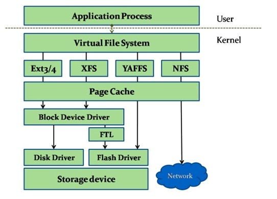
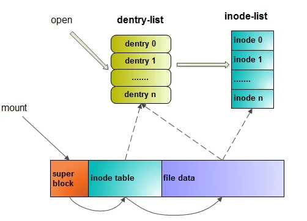
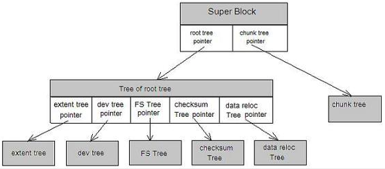
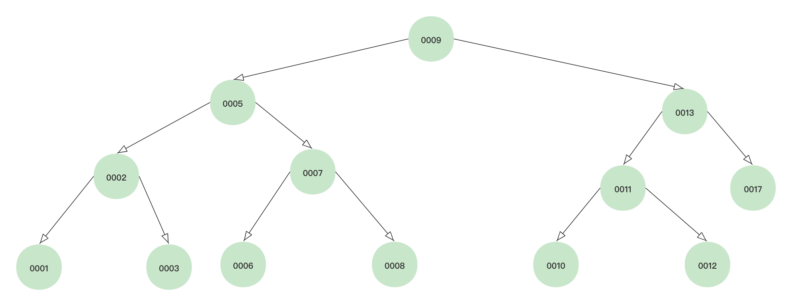
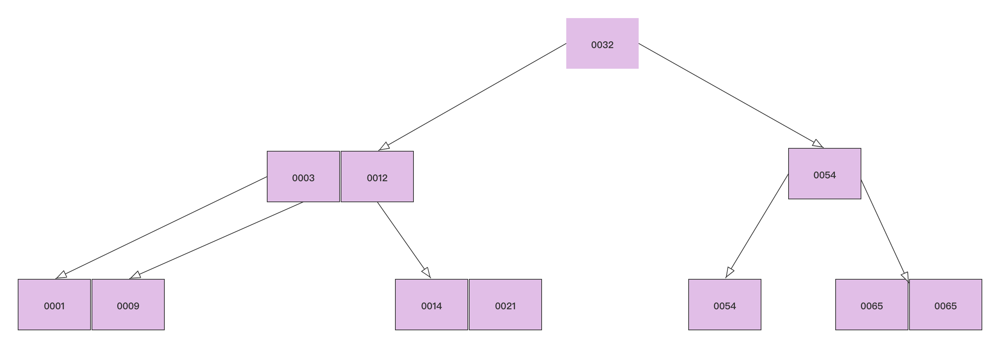

# 文件系统

Linux中文件的概念并不局限于普通的磁盘文件，而是指由字节序列构成的信息载体，I/O设备、socket等也被包括在内。因为有了文件的存在，所以需要衍生出文件系统去进行组织和管理文件，而为了支持各种各样不同的文件系统，所以有了虚拟文件系统的出现。

文件系统是一种存储设备上的文件、数据进行存储与组织的机制。这个定义中的关键词有两个——"存储设备"和"存储与组织的机制"。

* **存储设备**：包括硬盘、光盘、Flash、网络存储设备及其他存储设备。
* **存储与组织的机制**：目的是易于查询和存取文件。

&nbsp;

## 虚拟文件系统

Linux已经可以支持数十种文件系统，而且这些不同的文件系统可以共存于系统中，它们之间的关系并不是相互对立的，而是会经常进行文件与数据移动的，因此必须有一种统一的“语言”去支持它们的这种交流，虚拟文件系统就扮演了这个角色。

**虚拟文件系统通过在各种具体的文件系统上建立了一个抽象，屏蔽了不同文件系统间的差异，通过虚拟文件系统分层架构,在对文件进行操作时，便不需要去关心相关文件所在的具体文件系统细节。**

分层架构使得底层的操作细节被屏蔽，用户应用程序进行文件操作时，只需要考虑使用哪个系统调用，而不需要考虑操作的是位于哪个文件系统中的文件。

通过系统调用层，我们可以在不同的文件系统之间复制和移动数据，正是虚拟文件系统使得这种跨越不同存储设备和不同文件系统的操作成为了可能。

虚拟文件系统之所以能够衔接各种各样的文件系统，是因为它提供了一个通用的文件系统模型，该模型能够表示Linux支持的所有文件系统，包括了我们能够想到的一个文件系统应该具有的功能和行为。

虚拟文件系统提供的通用文件系统模型在内核中具体表现为一系列的抽象接口和数据结构，每个具体的文件系统都必须实现这些接口，并在组织结构上与该模型保持一致，如它们必须都支持像文件和目录这样的概念，也支持像创建文件和删除文件这样的操作。

我们可以把虚拟文件系统比作各种文件系统所共同推出的负责对外交流的“傀儡”，它本身没有实际的实施权，所有的决策实施都要通过躲在背后的每个具体文件系统来完成，正所谓每一个成功的虚拟文件系统背后都有很多个默默支持它的具体文件系统。

虚拟文件系统采用了面向对象的设计思路，将一系列概念抽象出来作为对象而存在，它们包含数据的也包含了操作这些数据的方法。当然，这些对象只能用数据结构来表示，而不可能超出C语言的范畴，不过即使在C++语言里面数据结构和类的区别也仅仅在于数据结构的成员默认公有，类的成员默认私有。

&nbsp;

### 虚拟文件系统类型

虚拟文件系统主要疣以下4个对象类型。

&nbsp;

#### 超级块(Super Block)

超级块对象代表一个已安装的文件系统，用于存储该文件系统的有关信息，如文件系统的类型、大小、状态等。对基于磁盘的文件系统，这类对象通常存放在磁盘的特定扇区上。对于并非基于磁盘的文件系统（如基于内存的文件系统sysfs），它们会现场创建超级块对象并将其保存在内存中。

&nbsp;

#### 索引节点(Inode)

索引节点对象代表存储设备上的一个实际的物理文件，用于存储该文件的有关信息。Linux将文件的相关信息(如访问权限、大小、创建时间等)与文件本身区分开。文件的相关信息又被称为文件的元数据。

&nbsp;

#### 目录项(Dentry)

目录项对象描述了文件系统的层次结构，一个路径的各个组成部分，不管是目录(虚拟文件系统将目录当作文件来处理)还是普通文件，都是一个目录项对象。例如，打开文件 `/home/test/test.c` 时，内核将为目录 `home`、`test`和文件 `test.c` 都创建一个目录项对象。

&nbsp;

#### 文件(File data)

文件对象代表已经被进程打开的文件，主要用于建立进程和文件之间的对应关系。它由 `open()` 系统调用创建，由 `close()` 系统调用销毁，并且仅当进程访问文件期间存在于内存之中。同一个物理文件可能存在多个对应的文件对象，但其对应的索引节点对象却是唯一的。

&nbsp;

### Btrfs

Btrfs(B-tree文件系统)，支持写入时复制(Cow)的文件系统，运行在Linux操作系统。目前是取代Linux的Ext3文件系统，改善Ext3的限制，特别是单个文件的大小，总文件系统大小或文件检查和加入Ext3未支持的功能，想可写快照(writable snapshots)、快照的快照(snapshots of snapshots)、内建的快照(snapshots of snapshots)、内建磁盘阵列(RAID)，以及子卷(subvolumes)。

btrfs文件系统中所有的metadata都由BTree管理。使用BTree的主要好处在于查找、插入、删除都很高效。

&nbsp;

#### B-Tree

B-Tree这种数据结构常常被用于实现文件系统及数据库索引。我们知道磁盘IO是非常昂贵的操作，所以操作系统采用预读的方式对此做了优化：每一次I/O时，不仅仅将当前磁盘地址的数据加载到内存，还会将相邻的数据也加载到内存缓冲区中。这主要是基于局部预读的原理：当访问一个地址数据的时候，与其相邻的数据很快也会被访问到。

数据库索引存储在磁盘上，索引的大小随着表中数据量的增长而增长，可以达到几GB甚至更多。因此当我们利用索引进行查询的时候，不可能把索引全部加载到内存中，只能逐一加载每个磁盘页。假设每次磁盘I/O读取一页，每个磁盘页对应了索引树上的一个节点。那么相对于二叉树性能来说，使用B-Tree来实现索引的关键因素就是磁盘I/O的次数。

&nbsp;

##### 4阶二叉树

如果查找`0010`，则整个过程需要进行4次I/O，树的高度和磁盘I/O的次数得到4，所以在最坏的情况下磁盘I/O的次数是由树的高度来决定的。由此来看，减少磁盘I/O的次数就是要压缩树的高度，使树从"瘦高"尽量变的"矮胖"。

&nbsp;

##### B-Tree

要使用M阶B-Tree树，需要满足以下几个条件:

* 每个节点最多拥有m颗子树;
* 根节点至少有2颗子树;
* 分支节点至少拥有m/2颗子树（除根节点和叶子节点外都是分支节点）;
* 所有叶子节点都在同一层上，每个节点最多可以有m-1个Key，并且以升序排列

如下图为3阶B-Tree，如果查找0021的话，需要进行3次I/O。相同数量的Key在B-Tree中生成的节点要远远少于二叉树中的节点，相差的节点数量就等同于磁盘I/O的次数。这样达到一定数量后，性能的差异就显现出来了。

#### 基于Extent的文件存储

在ext2文件系统中，数据块都是被单独管理的，Inode中保存有指向数据块的指针，文件占用了多少个数据块，索引节点里面就有多少个指针（多级）。对于一个大小为1GB的文件，4KB的块大小，就需要(1024×1024)/4=262 144个数据块，即需要262 144个指针，这些指针需要在创建文件的时候进行初始化，在删除文件的时候进行回收，极大地影响了性能。

Extent就是数据块的集合，**以前一次分配一个数据块，现在可以一次分配一个extent，里面包含很多数据块，同时索引节点里面只需要分配指向extent的指针就可以了**，这大大减少了指针的数量和层级，提高了操作大文件的性能。

&nbsp;

#### 动态索引节点分配

在ext2/3/4系列的文件系统中，索引节点的数量都是固定的，如果存储很多小文件的话，就有可能造成索引节点已经用完，但磁盘还有很多剩余的空间无法被使用的情况。**不过它也有一个好处，就是磁盘一旦损坏，恢复起来要相对简单，因为数据在磁盘上的布局是相对固定的。**

为了解决磁盘剩余空间无法被使用的问题，需要对索引节点进行动态分配：每一个索引节点作为B-Tree中的一个节点，用户可以无限制地任意插入新的索引节点，索引节点的物理存储位置是动态分配的，所以Btrfs没有对文件个数进行限制。

&nbsp;

#### 固态硬盘做的优化

固态硬盘采用闪存技术，内部没有磁盘、磁头等机械装置，读/写速率得到大幅提升。闪存不同于硬盘驱动器，在写数据之前必须先执行擦除操作，对擦除进行操作的次数也有一定的限制，因此，为了延长Flash的使用寿命，应该将写操作平均到整个Flash上。

Btrfs是少数有专门针对固态硬盘进行优化的文件系统，这些不仅能提高固态硬盘的使用寿命，而且能提高读/写性能。用户可以使用mount参数对固态硬盘做特殊优化处理。

&nbsp;

#### 支持元数据和数据的校验

##### Silent Data Corruption

block A中存放的数据为0x55，但读取出来的数据变成了0x54，因为读取操作并未报错，所以这种错误不能被上层软件察觉。解决这个问题的方法是保存数据的校验和，在读取数据后检查校验和，如果不符合，便知道数据出现了错误。校验和技术保证了数据的可靠性，避免了Silent Corruption现象（这种错误一般无法被立即检测出来，而是应用在后续访问数据的过程中，才发现数据已经出错，这种很难在数据发生错误那一刻被检查出来的错误，就称为静默数据破坏，即Silent Data Corruption）。

##### Btrfs支持元数据和数据的校验

**ext2/3对磁盘完全信任，所以没有采用校验和技术**。但不幸的是，磁盘的错误始终存在，不仅是廉价的IDE硬盘，就连昂贵的磁盘阵列也会存在Silent Corruption问题。而且随着存储网络的发展，即使数据从磁盘读取正确，也很难确保其能够安全地穿越网络设备。

Btrfs在读取数据的同时会读取相应的校验和，如果最终从磁盘读取出来的数据和校验和不相同，Btrfs会先尝试读取数据的镜像备份，如果数据没有镜像备份，则Btrfs将返回错误。数据在写入磁盘之前，Btrfs会计算相应的校验和，然后将校验和与数据同时写入磁盘。

Btrfs采用crc32算法计算校验和，为了提高效率，Btrfs将写数据和校验和的工作分别用不同的内核线程并行执行。

&nbsp;

#### Cow(写时复制)

文件系统中的写时复制是指在对数据进行修改的时候，不会直接在原来的数据位置上进行操作，而是找一个新的位置进行修改，优点是一旦系统突然断电，重启之后将不需要做fsck。Btrfs文件系统采用写时复制及事务机制保证了数据的一致性。

对Btrfs来说，所谓的写时复制，是指每次将数据写入磁盘时，先将更新的数据写入一个新的block，当新数据写入成功之后，再更新相关的数据结构指向新block。写时复制只能保证单一数据更新的原子性，但文件系统中很多操作需要更新多个不同的元数据，如创建文件时需要创建一个新的索引节点、增加一个目录项等，任何一个步骤出错，文件就不能被创建成功，因此可以将类似创建文件这样的一个完整操作过程定义为一个事务。

&nbsp;

#### Subvolume(子分区)

把文件系统的一部分配置为一个完整的被称为subvolume的子文件系统。通过subvolume，一个大的文件系统可以被划分为多个子文件系统，这些子文件系统共享底层的存储设备，在需要时便从底层设备中分配磁盘空间，过程类似于分配内存的malloc（）函数。这种模型里，底层的存储设备可以作为存储池。这种模型有很多优点，如可以充分利用磁盘的带宽、可以简化磁盘空间的管理等。

所谓充分利用磁盘的带宽，是指文件系统可以共享底层的磁盘，做到并行的读/写；所谓简化管理，是相对于LVM等卷管理软件而言的。采用存储池模型，每个文件系统的大小都可以自动调节。而使用LVM时，如果一个文件系统的空间不够了，该文件系统并不能自动使用其他磁盘设备上的空闲空间，必须要使用LVM的管理命令手动调节。

subvolume可以作为根目录，挂载到任意挂载点。假如管理员只希望用户访问文件系统的一部分，如希望用户只能访问`/var/test/`下面的内容，而不能访问`/var/`目录下的其他内容，那么便可以将`/var/test`做成一个subvolume。`/var/test`的这个subvolume便是一个完整的文件系统，可以用`mount`命令挂载。如果挂载到`/test`目录下，给用户访问`/test`的权限，那么用户便只能访问`/var/test`下面的内容。

&nbsp;

#### 软件磁盘阵列(RAID)

磁盘阵列技术有很多非常吸引人的特性，如用户可以将多个廉价的IDE磁盘组合为RAID0阵列，从而变成一个大容量的磁盘；RAID1和更高级的磁盘阵列配置还提供了数据冗余保护，使存储在磁盘中的数据更加安全。Btrfs很好地支持了软件磁盘阵列，包括RAID0、RAID1和RAID10。

&nbsp;

#### 压缩

Btrfs内置了压缩功能。通常将数据写入磁盘之前进行压缩会占用很多的CPU时间，这必然会降低文件系统的读/写效率。但随着硬件技术的发展，CPU处理时间和磁盘I/O时间的差距不断加大，在某些情况下，花费一定的CPU时间和占用一定的内存，能大大减少磁盘I/O的数量，这反而能够提高整体的效率。

例如，一个文件在不经过压缩的情况下需要进行100次磁盘I/O。但花费少量CPU时间进行压缩后，只需要进行10次磁盘I/O就可以将压缩后的文件写入磁盘。在这种情况下，I/O效率反而提高了。当然，这取决于压缩率。目前Btrfs已经能够支持zlib、LZO与zstd等方式进行压缩。
