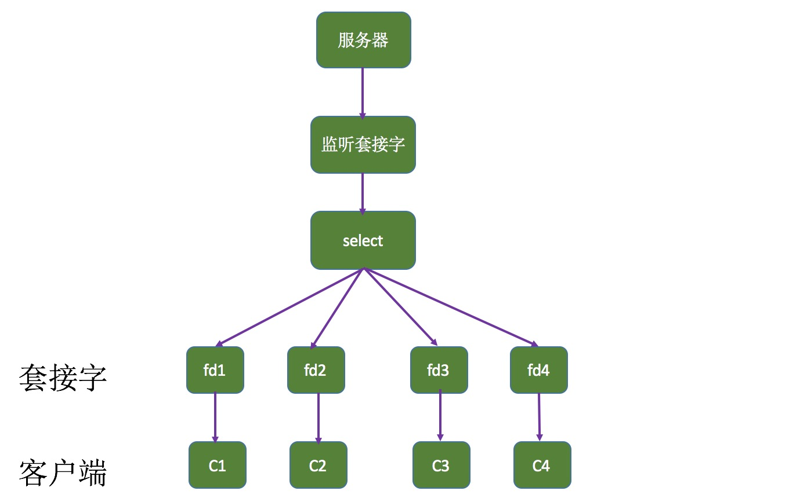

# select函数
允许进程指示内核等待多个事件中的任何一个发生,并只有一个或多个时间发生或经历一段制定的时间后才会被唤醒。




## select实现

### select 声明

```
#include <sys/select.h>
#include >sys/time.h>

// 若有就绪描述符反悔其数据。
// 若超市则为0
// 若出错则-1

// maxfdp1: 最大文件描述符(maxfdp1 = maxfd + 1)
// readset: 内核读描述字
// writeset: 内核写描述字
// exceptset: 内核异常描述字
// 如果某一个参数不使用,则设置为空指针。

int select(int maxfdp1,fd_set *readset,fd_set *writeset,fd_set *exceptset,const struct timeval *timeout);
```

### fd_set 声明
struct fd_set可以理解为一个集合,这个集合中存放的事文件描述符,可以通过宏进行设置。

```
// 清空集合
void FD_ZERO(fd_set *fdset);

// 将一个给定的文件描述符加入集合中
void FD_SET(int fd, fd_set *fd_set);

// 将一个给定的文件描述符从集合中删除
void FD_CLR(int fd, fd_set *fdset);

//  检查集合中指定的文件描述符是否可以读写
int FD_ISSET(int fd, fd_set *fdset);
```


## select 调用过程

* 使用copy_from_user从用户空间拷贝fd_set到内核空间。
* 注册回调函数__pollwait
* 遍历所有fd(对于socket,这个poll方法是sock_poll,sock_poll根据情况会调用tcp_pool,udp_pool或者datagram_pool。以tcp_pool为例,核心实现就是__pollwait)
* __poolwait主要工作就是把current(当前进程)挂到设备的等待队列中,不同的设备有不同的等待队列,对于tcp_pool来说,其等待队列是sk->sk_sleep(并不代表进程已经sleep)。当设备收到一条消息(网络设备)或填写完文件数据(磁盘设备)后,会唤醒设备等待队列上睡眠的进程,这时current便被唤醒。
* pool方法返回时会返回一个描述读写操作是否就绪的mask,根据mask掩码给fd_set赋值。
* 如果所有fd没有一个可读写的mask掩码,则会调用schedule_timeout是调用select的进程进入睡眠。当设备驱动发生自身资源可读写后,会唤醒其等待队列上睡眠的进程。如果超过一定的超时时间，还是没人唤醒,则调用select的进程会重新被唤醒获得CPU。进而重新遍历fd,判断有没有就绪的fd。
* 把fd_set从内核空间拷贝到用户空间。


## select 睡眠和唤醒过程

### select睡眠过程
select会遍历它所监测的fd_set内的所有文件描述符(驱动程序的poll函数)。驱动程序提供的poll函数首先会将调用select的用户进程插入到该设备驱动对应资源的等待队列(如读/写等待队列)，然后返回一个bitmask告诉select当前资源哪些可用。当select遍历完所有fd_set内指定的文件描述符(poll函数),发现没有一个资源可用(即没有一个文件可供操作)，则select让该进程睡眠, 一直等到有资源可用为止，进程被唤醒(或者timeout)继续往下执行。

### select 唤醒过程
唤醒该进程通常是在所监测文件的设备驱动内实现的。驱动程序维护了针对自身资源读写的等待队列。当设备驱动发现自身资源变为可读写，并且有进程睡眠在该资源的等待队列上时，就会唤醒这个资源等待队列上的进程。

#### select Demo

```
int fds[128];
const int len = 128;


int startup(char *ip,int port)
{
    int listen_sock = socket(AF_INET,SOCK_STREAM,0);
    struct sockaddr_in local;
    local.sin_family = AF_INET;
    local.sin_addr.s_addr = inet_addr(ip);
    local.sin_port = port;
    bind(&listen_sock,(struct sockaddr*)&local,sizeof(local));
    if(listen(listen_sock,5) < 0)
    {
        perror("listen");
    }
    return listen_sock;
}

int main()
{
    if(argc != 3)
    {
        usage(argv[0]);
        exit(1);
    }
    int i = 0;
    for(;i < len;i++)
    {
        fds[i] = -1;
    }

    int listen_sock = startup(argv[1],atoi(argv[2]));

    fd_set rfds;
    fds[0] = listen_sock;
    int done;
    while(!done)
    {
        int max_fd = -1;
        FD_ZERO(&rfds);
        for(int i = 0;i < len;i++)
        {
            if(fds[i] != -1)
            {
                FD_SET(fds[i],&rfds);
            }
            max_fd = fd[i] > max_fd ? fd[i]:max_fd;
        }
        struct timeval timeout = {5,0};
        switch(select(max_fd+1,&rfds,NULL,NULL,NULL))
        {
            case 0:
                printf("timeout\n");
                break;
            case -1:
                perror("select");
                break;
            default:
                {
                    if(FD_ISSET(listen_sock,&rfds))
                    {
                        struct sockaddr_in peer;
                        int len = sizeof(peer);
                        int new_fd = accept(listen_sock,\
                        (struct sockaddr*)&peer,&len);
                        if(new_fd > 0)
                        { 
                            printf("get a new client->%s:%d\n",\
                            inet_addr(peer.sin_addr),\
                            ntohs(peer.sin_port));
                            for(int i = 0; i < len;i++)
                            {
                                if(fds[i] == -1)
                                {
                                    fds[i] = new_fd;
                                    break;
                                }
                            }
                            if(i == len)
                            {
                                close(new_fd);
                            }
                        }
                    } else {
                        char buf[1024];
                        for(int i = 0; i < len;i++)
                        {
                            if(i != 0 && FD_ISSET(fds[i],\
                                        &rfds))
                            {
                                ssize_t _s = read(fds[i],buf,sizeof(buf))
                                if(_s > 0)
                                {
                                    buf[_s] = '\0';
                                    printf("client:%s\n",buf);
                                }
                                else if(_s == 0)
                                {
                                    printf("client:%d is close\n",fds[i]);
                                    close(fds[i]);
                                    fds[i] = -1;
                                }
                                else 
                                    perror("read");
                            }
                        }
                    }
                }
                break;          
        }
    }
}
```

## select 缺点
* 每次调用select都需要把fd集合从用户态拷贝到内核态，这个开销在fd很多时会很。
* 每次调用select都需要在内核遍历传递进来的所有fd，这个开销在fd很多时也很大。
* select支持的文件描述符数量太小了,默认是1024(具体根据不同平台，不太一样)。

```
# Linux 
## /usr/include/sys/select.h

/* Maximum number of file descriptors in `fd_set'.  */
#define FD_SETSIZE      __FD_SETSIZE
typedef long int __fd_mask;

## /usr/include/linux/posix_types.h
#define __FD_SETSIZE    1024

/* fd_set for select and pselect.  */
typedef struct
{
#ifdef __USE_XOPEN
    // __fd_mask ==> 8byte
    // fds_bits[__FD_SETSIZE / __NFBITS] ==> 8byte[16] ==> (8*8)bit[16] => 1024
    __fd_mask fds_bits[__FD_SETSIZE / __NFDBITS];
# define __FDS_BITS(set) ((set)->fds_bits)
#else
    __fd_mask __fds_bits[__FD_SETSIZE / __NFDBITS];
# define __FDS_BITS(set) ((set)->__fds_bits)
#endif
} fd_set;
```