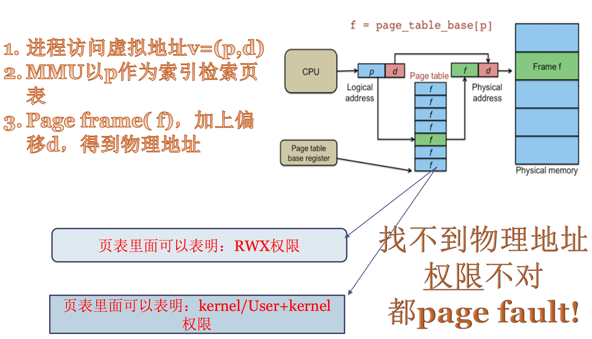
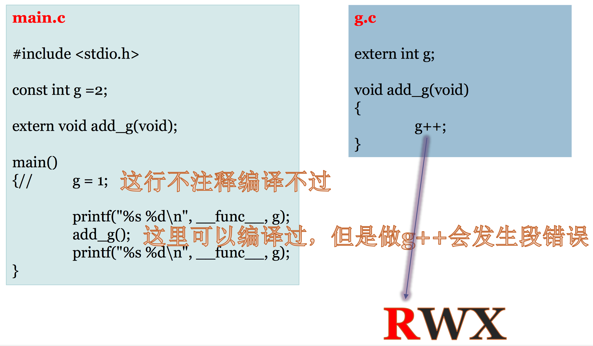
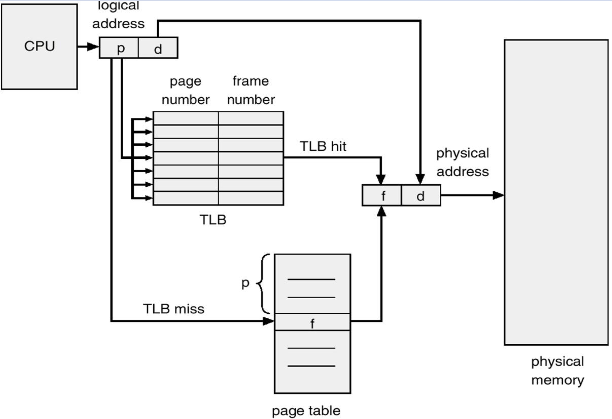
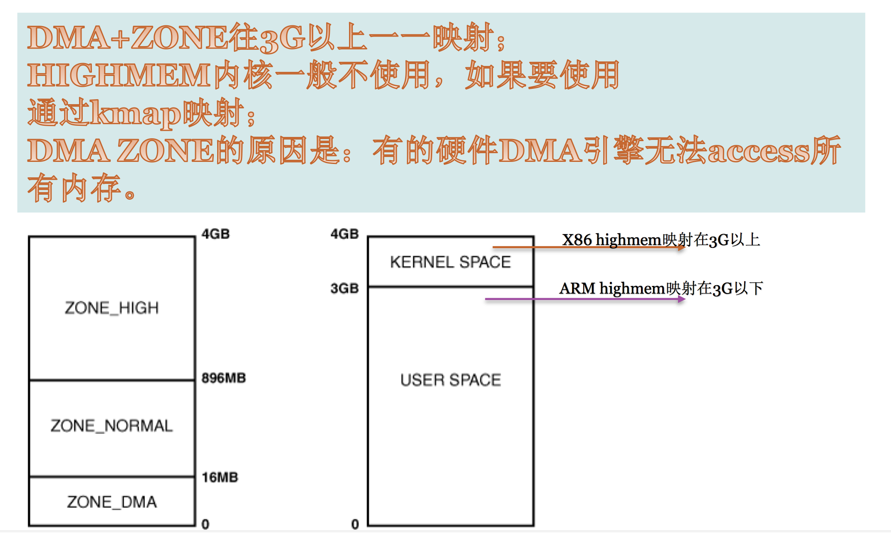
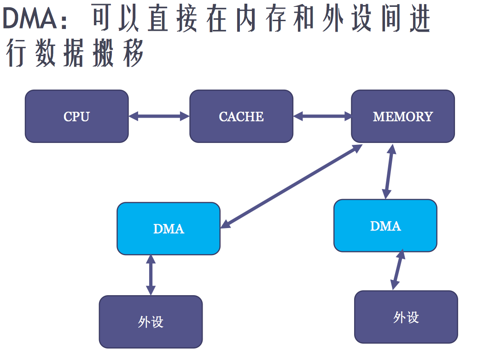
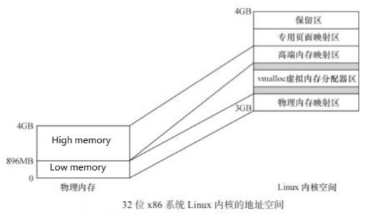
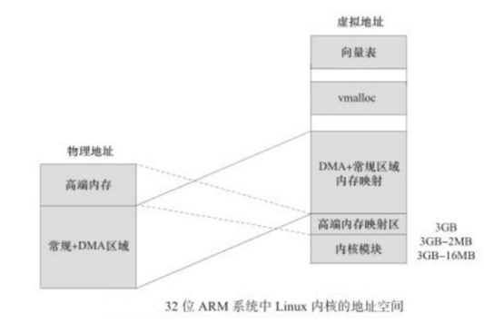
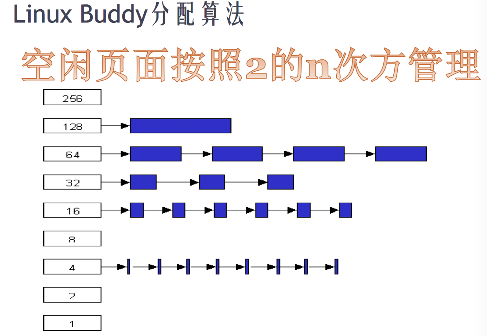
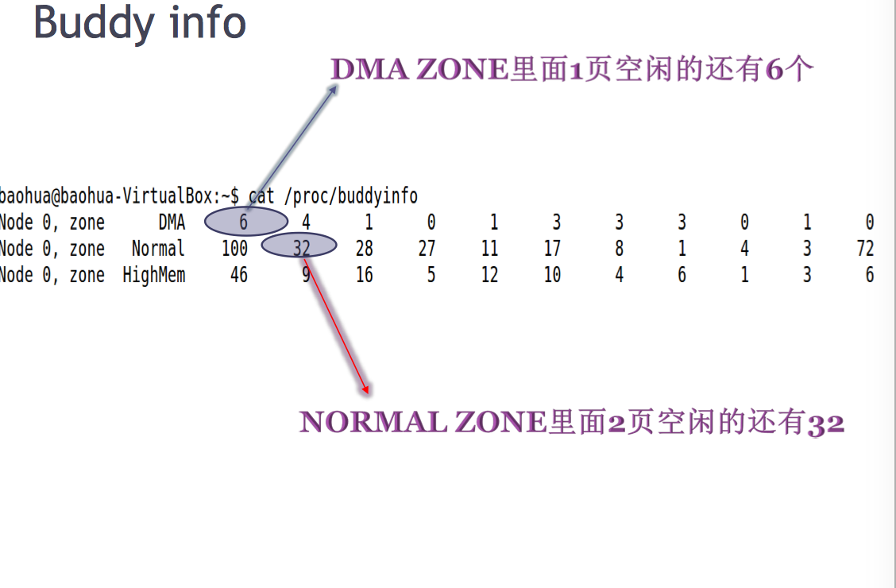

# Linux 内存管理

## 摘要
* MMU与分页机制
* 内存模型
* 内存Zone
* Linux Buddy分配算法
* CMA技术(连续内存分配器)
* 名词解释


## MMU与分页机制

### MMU
**MMU**(内存管理单元),是一个硬件。辅助操作系统进行内存管理,提供虚拟地址和物理地址的映射、内存访问权限保护和Cache缓存控制等硬件支持。CPU一旦开启MMU,CPU就只能看到虚拟地址(程序员也只能看到虚拟地址),只有MMU能看到物理地址。

#### MMU功能

* 提供虚拟地址和物理地址的映射</br>
&emsp;&emsp; 例如,CPU访问一个32位的虚拟地址0x12345670,假设MMU的管理把每一页的内存分成4KB(在32位操作系统通常采用的Page Size位4K),上图中p(页号)即为12345,d(页内偏移地址)即为670。首先用p去查页表(页表本身也在内存),找到对应的页表项(PTE),PTE里面填写了这一页虚拟地址所对应的物理地址。

* 内存访问权限保护
&emsp;&emsp; 每个PTE中除了有虚拟地址和物理地址对应关系外,还有当前页的RWX权限。比如,代码段中只有R+X权限。如果食用一个指针去写代码段,就会发生"Page fault。"

#### 内存寻址流程图


<br>
<html>
<font color="#F08080" size="3">&emsp;&emsp;&emsp;注:
<br>
&emsp;&emsp;&emsp; 1. 基址寄存器存页表的基地址,每次进程切换时,寄存器的值都会改变,因为每一个进程的页表都不一样。
<br>
&emsp;&emsp;&emsp; 2. 两种情况都会导致"Page fault"。第一种:虚拟地址没有找到对应的物理地址;第二种: 虚拟地址有对应的物理地址,但权限不对。
</font>
</html>

#### 页表其它权限


&emsp;&emsp;&emsp; 另外一个重要的地方是,在MMU的页表中还可以标注这一页的另一个并行的权限。即这个虚拟地址可以在用户态与内核态访问,还是只能在内核态访问。
<br>
&emsp;&emsp;&emsp; IA32下,内核空间地址一般映射到3G~4G(VM),在PTE中就把3G以上的页表设置为只有当CPU陷入到内核模式才能访问。这样就限制了用户态程序对内核数据的访问。
&emsp;&emsp;&emsp; 前段时间Intel Meldown漏洞就属于旁路攻击,突破硬件限制。


#### 虚拟地址Vs.物理地址
&emsp;&emsp;&emsp; "虚拟地址"是个指针,"物理地址"是个整数(32位或者64位整数,不是指针),可参考内核代码对物理地址定义(include/linux/types.h):

#### phys_addr
```bash
#ifdef CONFIG_PHYS_ADDR_T_64BIT
typedef u64 phys_addr_t;
#else
typedef u32 phys_addr_t;
#endif

typedef phys_addr_t resource_size_t;
```

#### TLB(Translation Looksize Buffer)
&emsp;&emsp;&emsp; 由于页表访问速度很慢(Page table位于内存中)。引出MMU的核心部件TLB(硬件级页表缓存部件,cpu内部硬件),TLB是MMU核心部件,它缓存少量的虚拟地址和物理地址的转换关系,是转换表的Cache,俗称"快表"。
<br>
&emsp;&emsp;&emsp; 当TLB中没有缓冲对应的地址转换关系时,需要通过对页表(大多数处理器的页表为多级页表)的访问来获得虚拟地址和物理地址的对应关系,引出MMU的另一个部件TTW(Translation Table walk)。TTW成功后,结果应写入TLB中。

#### CPU寻址流程


<font color=#F08080	 size=3>&emsp;&emsp;&emsp;注:
<br>
&emsp;&emsp;&emsp; 每个进程都有单独的page table,当进程发生切换时通过修改寄存器值,当前进程虚拟地址和page table进行关联。
</font>

#### MPU(Memory protection unit)
&emsp;&emsp;&emsp; 内存保护单元,它和MMU相比。没有虚拟地址和物理地址映射,只能对内存做权限管理(实模式)。

## 内存模型

### 共享存储型多处理器有两种模型
* 均衡存储器存储(Uniform-Memory-Access，简称UMA)模型
* 非均匀存储器存取（Nonuniform-Memory-Access，简称NUMA）模型


#### UMA模型
&emsp;&emsp;&emsp; 物理存储器被所有处理机均匀共享。所有处理机对所有存储字具有相同的存取时间，这就是为什么称它为均匀存储器存取的原因。每台处理机可以有私用高速缓存,外围设备也以一定形式共享。

#### NUMA模型
&emsp;&emsp;&emsp; NUMA模式下，处理器被划分成多个”节点”（node）， 每个节点被分配有的本地存储器空间。 所有节点中的处理器都可以访问全部的系统物理存储器，但是访问本节点内的存储器所需要的时间，比访问某些远程节点内的存储器所花的时间要少得多。

<br><br>
### 存储节点(None)
<br>

<font color=#1c1c1c size=4> TODO </font>


### 内存管理区(Zone)
&emsp;&emsp;&emsp; Linux系统把物理内存划分为三个层次来管理。

|层次|描述|
|-|-|
|存储节点(Node)|CPU被划分为多个节点(node), 内存则被分簇,每个CPU对一个本地物理内存,即一个CPU-node对应一个内存簇bank,即每个内存簇呗认为一个节点|
|管理区(Zone)|每个物理内存节点node被划分为多个内存管理区域,用于表示不同范围的内存,内核可以使用不同的映射方式映射物理内存|
|页面(Page)|内存被细分为的多个页面帧,页面是最基本的页面分配单位|

#### 为什么要将内存node分成不同的区域zone?
&emsp;&emsp;&emsp; NUMA结构下, 每个处理器CPU与一个本地内存直接相连, 而不同处理器之前则通过总线进行进一步的连接, 因此相对于任何一个CPU访问本地内存的速度比访问远程内存的速度要快, 而Linux为了兼容NUMA结构, 把物理内存相依照CPU的不同node分成簇, 一个CPU-node对应一个本地内存pgdata_t。
<br>
&emsp;&emsp;&emsp;  这样已经很好的表示物理内存了, 在一个理想的计算机系统中, 一个页框就是一个内存的分配单元, 可用于任何事情:存放内核数据, 用户数据和缓冲磁盘数据等等. 任何种类的数据页都可以存放在任页框中, 没有任何限制。

#### 但是Linux内核又把各个物理内存节点分成个不同的管理区域zone, 这是为什么呢?
&emsp;&emsp;&emsp; 因为实际的计算机体系结构有硬件的诸多限制, 这限制了页框可以使用的方式。尤其是, Linux内核必须处理80x86体系结构的两种硬件约束。

* ISA总线的直接内存存储DMA处理器有一个严格的限制 : 他们只能对RAM的前16MB进行寻址
* 在具有大容量RAM的现代32位计算机中, CPU不能直接访问所有的物理地址, 因为线性地址空间太小, 内核不可能直接映射所有物理内存到线性地址空间, 我们会在后面典型架构(x86)上内存区域划分详细讲解x86_32上的内存区域划分。

<html>
<font color=#F08080	 size=3>&emsp;&emsp;&emsp;注:
<br>
&emsp;&emsp;&emsp; 1. 因此Linux内核对不同区域的内存需要采用不同的管理方式和映射方式, 因此内核将物理地址或者成用zone_t表示的不同地址区域。
</font>
</html>

### 内存管理区类型Zone_type
&emsp;&emsp;&emsp; 由于硬件的一些约束,低端的一些地址被用于DMA,当实际内存大小超过了内核所能使用的线性地址的时候,一些高处地址处的物理地址不能简单持久的直接映射到内核空间。因此,内核将内存的节点node分成了不同的内存区域方便管理和映射。

#### IA32内核区域Zone分布


#### Zone类型数据结构

```bash
enum zone_type {
#ifdef CONFIG_ZONE_DMA
        /*
         * ZONE_DMA is used when there are devices that are not able
         * to do DMA to all of addressable memory (ZONE_NORMAL). Then we
         * carve out the portion of memory that is needed for these devices.
         * The range is arch specific.
         *
         * Some examples
         *
         * Architecture         Limit
         * ---------------------------
         * parisc, ia64, sparc  <4G
         * s390                 <2G
         * arm                  Various
         * alpha                Unlimited or 0-16MB.
         *
         * i386, x86_64 and multiple other arches
         *                      <16M.
         */
        ZONE_DMA,
#endif
#ifdef CONFIG_ZONE_DMA32
        /*
         * x86_64 needs two ZONE_DMAs because it supports devices that are
         * only able to do DMA to the lower 16M but also 32 bit devices that
         * can only do DMA areas below 4G.
         */
        ZONE_DMA32,
#endif
        /*
         * Normal addressable memory is in ZONE_NORMAL. DMA operations can be
         * performed on pages in ZONE_NORMAL if the DMA devices support
         * transfers to all addressable memory.
         */
        ZONE_NORMAL,
#ifdef CONFIG_HIGHMEM
        /*
         * A memory area that is only addressable by the kernel through
         * mapping portions into its own address space. This is for example
         * used by i386 to allow the kernel to address the memory beyond
         * 900MB. The kernel will set up special mappings (page
         * table entries on i386) for each page that the kernel needs to
         * access.
         */
        ZONE_HIGHMEM,
#endif
        ZONE_MOVABLE,
        __MAX_NR_ZONES
};
```

&emsp;&emsp;&emsp; 不同的管理区的用途是不一样的,ZONE_DMA类型的内存区域在物理内存的低端,主要是ISA设备只能用低端的地址做DMA操作。ZONE_NORMAL类型的内存区域直接被内核映射到线性地址空间上面的区域(line address space), ZONE_HIGHMEM将保留给系统使用,是系统中预留的可用内存空间,不能被内核直接映射。


### ZONE_DMA 
&emsp;&emsp;&emsp; DMA相对于内存与cpu相对于内存一样,可以直接访问内存。由于某些DMA引擎可能存在缺陷,并不一定能访问所有内存(如,x86 ISA总线上的DMA引擎在访问内存时,地址总线只能访问到16M以下,其硬件根本访问不了16M以上的内存),因此才会有ZONE_DMA。ZONE_DMA分配多大内存由硬件决定。例如,某些体系结构在内存的任何地址上执行DMA都没有问题,在这些体系结构上,ZONE_DMA为空。
<br>
&emsp;&emsp;&emsp; ZONE_DMA的内存不是专用于DMA的,而是有缺陷的DMA要申请内存时,从这个区域申请,如某个驱动模块不是专用于DMA的,而是有缺陷的DMA要申请内存时,从这个区域申请,如某个驱动模块调用void *dma_alloc_coherent(struct_device *dev, size_t size, dma_addr_t *handle, gfp_t gfp);函数申请一个ZONE_DMA内存区域时,需要讲gfp参数写为GFP_DMA。

#### DMA引擎(DMA Engine)
&emsp;&emsp;&emsp;  DMA引擎就是DMA控制器,从软件上说,从软件上来说，其实就是一个dma框架，在该框架下针对你的具体dma控制器开发出dma驱动,然后其他drivers比如audio,network,crypto等就都可以调用统一的dma相关的api来使用你的dma。
<br>
&emsp;&emsp;&emsp; DMA引擎和CPU都可以访问物理内存任何一个地址.当DMA和CPU同时访问内存时,硬件上有一个仲裁器会判断谁的优先级高,谁就可以访问内存.DMA并不是可以访问所有内存,而是有限制的,只可以访问指定zone内内存。

#### GFP_DMA:
&emsp;&emsp;&emsp; 外设驱动在申请内存时,可以带入GFP_DMA标记。当系统有ZONE_DMA,则从DMA区域分配内存.没有该标记则从ZONE_NORMAL分配.因此想利用ZONE_DMA需要排除其它驱动不再使用此标记。

#### DMA 访问内存流程图


### ZONE_HIGHMEM
&emsp;&emsp;&emsp; 在IA32下,0~3G是用户空间的虚拟地址,3G~4G是内核空间的虚拟地址。Linux 为了使内核访问内存简单化,机器开始启动就把一段物理地址直接线性映射(映射并非被占用)到3G以上的虚拟地址。
<br>
&emsp;&emsp;&emsp; 注意,物理内存可能大于1G,是无法全部线性映射到3G~4G的虚拟地址空间。所以,Linux直接在物理内存上做了界限(32位X86系统这个界限为896MB),低于这个界限的才做一一映射,低于这个界限的称为Low memory。高于这个界限的称为High memory。
<br>
&emsp;&emsp;&emsp; Low memory 包含了ZONE_NORMAL、ZONE_DMA。注意,Low memory虽然开机即线性映射,但并不意味着Low memory已经被内核用掉,内核要使用内存时与应用程序一样需要申请的。Low memory的物理地址和虚拟地址是一个直接的线性映射,可以使用内核API:phys_to_virt和virt_to_phys在物理地址和虚拟地址之间直接映射,而High memory则不能用这两个API。
<br>
&emsp;&emsp;&emsp; 内核空间一般不使用High memory,kmalloc申请的内存一般都在Low memory。内核空间使用High memory时调用kmap进行映射。x86会把High memory映射到虚拟地址3GB以上,而ARM会映射到3G-2MB ~ 3G。如下图所示:

#### 32位X86


#### 32位ARM


### ZONE_NORMAL
&emsp;&emsp;&emsp; ZONE_NORMAL就是正常可寻址的页。
 

&emsp;&emsp;&emsp; 综合上述,High memory 产生的原因是不可能在虚拟地址映射区将所有的物理地址都做一一映射;ZONE_DMA产生的原因是DMA引擎硬件缺陷导致。x86_32分区总结如下:
|Zone|描述|物理内存|
|-|-|-|
|ZONE_DMA|DMA使用的页|<16MB|
|ZONE_NORMAL|正常可寻址的页|16~896MB|
|ZONE_HIGHMEM|动态映射的页|>896BM|

<br>
&emsp;&emsp;&emsp; 注意:Zone的划分没有任何物理意义,只不过是内核为了管理页而采取的一种逻辑上的分组。

## Linux Buddy算法

### Buddy算法
&emsp;&emsp;&emsp;  Buddy是所有Zone内存管理统一的算法。free_area对应一个域中的物理页面，页面的管理采用buddy算法。在buddy算法中物理内存被分为11个组，其中第0,1，N个组分别对应2^0、2^n个连续物理界面。当分配2^n个页面是就会到相应的组去寻找，若没有则向下寻找同时向上递归合并空闲块。
<br>
&emsp;&emsp;&emsp;  Buddy算法最主要的特点就是任何区域里的空闲内存都以2^n次方进行拆分和合并。例如,假设ZONE_NORMAL有16页内存(2^4),此时有人申请1页内存,Buddy算法会把剩下的15页拆分成8+4+2+1,放到不同的链表中。此时再申请4页,直接给4页,若再申请4页,则从8页中给4页,正好剩下4页。Buddy算法的精髓在于任何正整数都可以拆分成2^n次方之和。

#### Buddy 算法

 
&emsp;&emsp;&emsp;  可以通过/proc/buddyinfo查看内存空闲的一些情况。

#### /proc/buddyinfo


### Buddy算法缺点
&emsp;&emsp;&emsp; 应用程序的虚拟地址映射到哪页物理地址,物理地址连续是否都无所谓。但DMA引擎中没有MMU,有时候需要连续物理内存。比如,一个Cache中有一个DMA,需要用DMA将拍摄的一张图片从camera搬移到内存,这时DMA申请连续16MB内存进行搬移,但此时即物理内存空闲100M(但不连续),DMA也申请不到的。

### CMA(Contiguous Memory Allocator)算法
&emsp;&emsp;&emsp; Buddy算法会导致内存碎片化(空闲内存很多,但连续内存很少),为了解决camera例子的问题,Linux可以开机就将16MB内存预留给camera,即使不用也占用着浪费掉,而CMA技术就是为了避免内存浪费,使16MB内存不预留,应用程序可以用,一旦camera要用,CMA把这16MB内存挤出去给camera。

#### 解决Buddy算法内存碎片方法


<br>
&emsp;&emsp;&emsp; 由于应用程序的虚拟地址映射到哪个物理地址,连续是否都无所谓,甚至将虚拟地址move到别的物理地址都没有关系,只要虚拟地址不变应用程序都不会察觉。所以一般应用程序申请内存时可以附带movable标记,Linux就可以把movable标记的应用程序的内存申请放到CMA区域中。当camera DMA申请内存时,就"漫山遍野"申请很多4k(一页)内存,把movable标记应用程序搬移到这些内存中去,注意搬移内存会修改应用程序的页表项。虽然虚拟地址不变,但到物理地址的映射已经改变。这样之前的16MB内存就被挤出去给camera的DMA了。

#### CMA工作机制


<br>
&emsp;&emsp;&emsp; 注意:CMA是与DMA的API结合起来使用的,当使用DMA的API申请内存时,才会出发CMA机制。可以在dts中指定哪一段内存做CMA,既可以指定一个默认全局的CMA池,也可以给某一个特定的设备指定一个CMA池。具体实现方法详见内核文档:Documentation/devicetree/bindings/reserved-memory/reserved-memory.txt 


### 名词解释
* 页表: 页表时一种特殊的数据结构,放在系统空间的页表区,存放逻辑页与物理页帧的对应关系。每一个进程都拥有一个自己的页表。PCB表中有指针指向页表。
* TLB: TLB(Translation Lookaside Buffer)转换检测缓冲区是一个内存管理单元,用于改进虚拟地址到物理地址转换速度的缓存。
