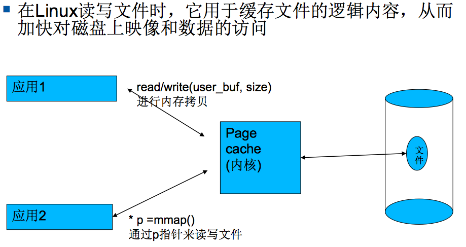
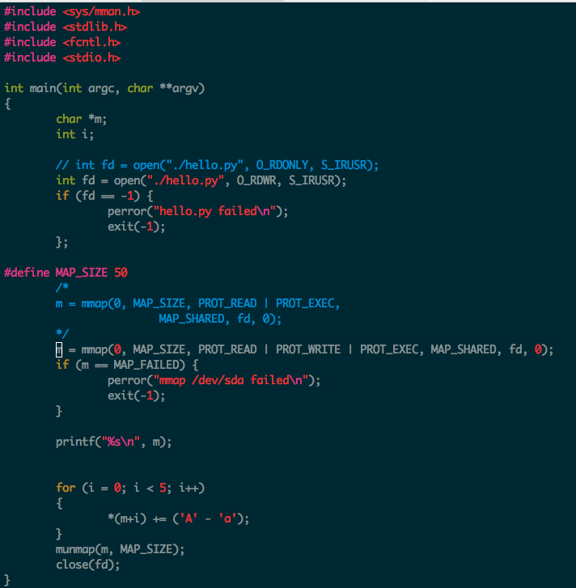
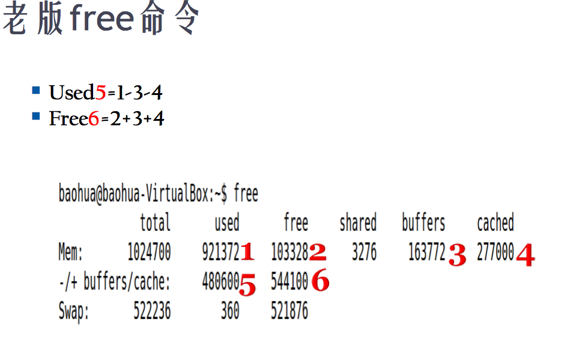
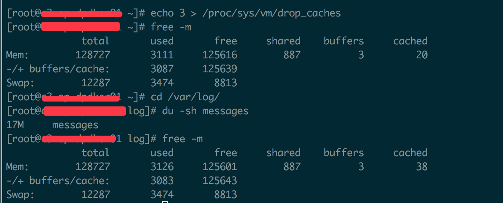
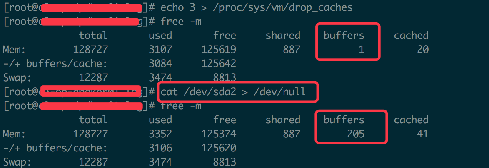
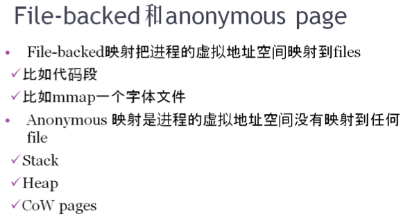
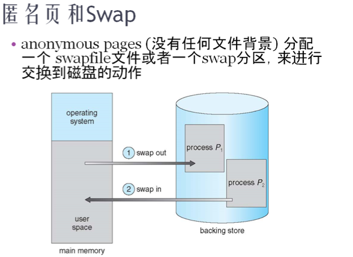
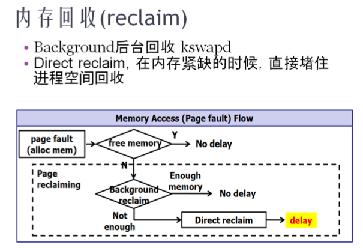
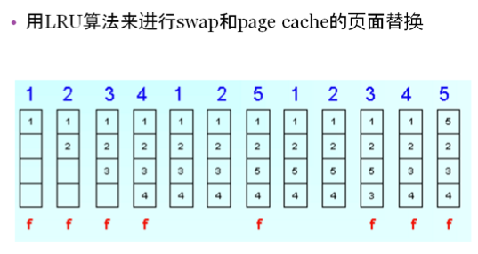
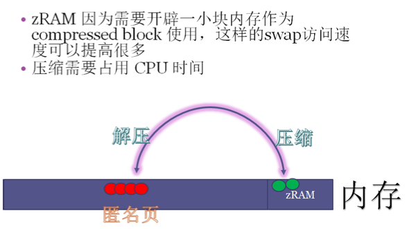

# Linux内存管理 - 内存与I/O的交换

## 摘要
* page cache
* free命令的详细解释
* read、write和mmap
* file-backed的页面和匿名页
* swap以及zRAM
* 页面回收和LRU

###  思考
&emsp;&emsp;&emsp; Linux总是以Lazy的方式给应用程序分配内存。包括堆、栈(函数调用越深,用的栈越多,最终发生page fault才得到栈)、代码段、数据段。那么,这些已经得到内存的段一直占用着内存吗? 

### 名词解释
* swap

&emsp;&emsp;&emsp; swap在Linux可以翻译成两个意思。动词，内存交换。内存和磁盘的颠簸行为;名词,linux有一个硬盘分区,被做成swap分区。当不使用swap分区的时候,linux内存也在进行swap,因为有文件背景的页面也在进行swapping。

* buf
&emsp;&emsp;&emsp; 一个程序读取文件时,会先申请一块儿内存数组,称为buffer。然后每次调用read,读取设定字节长度的数据,写入buffer。之后的程序都是从buffer中获取数据,当buffer使用完后,再进行下一次调用,填充buffer。

## Page cache
&emsp;&emsp;&emsp; 在linux读写文件时,它用于缓存文件的逻辑内容,从而加快对磁盘上映像和数据的访问(下次再读文件时,如果page cache有数据,则直接从内存中获取数据)。

### Linux读写文件方式
&emsp;&emsp;&emsp;linux下读写文件,主要有两种方式:

&emsp;&emsp;&emsp; * read/write
 
&emsp;&emsp;&emsp;&emsp;&emsp;&emsp; 调用read读文件,Linux内核会申请一个page cache,然后把硬盘文件读到page cache中。再将内核空间的page  cache数据拷贝到用户态的buf中。
 
&emsp;&emsp;&emsp;&emsp;&emsp;&emsp; 调用write写文件,则将用户空间buf拷贝到内核空间page cache(可通过sync 将内存数据刷到磁盘)。

&emsp;&emsp;&emsp; * mmap
 
&emsp;&emsp;&emsp;&emsp;&emsp;&emsp; 操作文件为了避免用户空间到内核空间拷贝,mmap直接把文件映射成一个虚拟地址指针,这个指针指向内核申请的page cache。内核知道page cache与文件的对应关系。只要直接对这个指针操作,就直接操作了这个文件。

&emsp;&emsp;&emsp; 编译和运行结果:

&emsp;&emsp;&emsp; mmap看起来是由一个虚拟地址对应一个文件(可以直接用指针访问文件),本质上是把进程的虚拟地址空间映射到DRAM(内核从这片区域申请内存做page cache),而这个page cache对应磁盘的某个文件,且linux 内核会维护page cache和磁盘中文件的交换关系。
 

&emsp;&emsp;&emsp; Page cache可以看作磁盘的一个缓存,应用程序在写文件时,其实只是将内容写入了page cache,然后使用sync才能真的写入文件。
&emsp;&emsp;&emsp; Page cache可以极大的提高系统整体性能。如,进程A读一个文件,内核空间会申请pache cache与此文件对应,并记录对应关系。进程B再次读同样的文件就会直接命中上一次的page cache,读写速度显著提升。但Page cache会根据LRU(最近最少使用)算法进行替换。

### Page cache对应用程序的影响
&emsp;&emsp;&emsp; Pache cache到底对程序是否真的有性能提升,需要试验进行验证。如下是一个验证Page cache对程序影响的例子。

&emsp;&emsp;&emsp; 通过如上的执行结果可以看出,相同的程序执行。第二次执行之间比第一次提升1倍多。什么原因导致的呐？

&emsp;&emsp;&emsp; 通过再次对两次执行结果详细

比较,发现第一次执行时Major page fault(从磁盘swap)共发生14次,第二次Major page fault 0次;第一次 File system inputs 共发生5648次,第二次File system inputs发生0次。通过这样的比较,相同程度的两次执行时间差消耗在了磁盘IO上。所以Page Cache对程序的影响还是挺大的。

注意:
 
&emsp;&emsp;&emsp; cache可以通过/proc/sys/vm/drop_caches强行释放。1 释放 page cache, 2释放dentries和inode, 3 释放两者。
 

## free命令的详细解释
 

&emsp;&emsp;&emsp; Buffers与Cache都是文件系统的缓存,没有本质区别,唯一区别是背景不同:
 
 
&emsp;&emsp;&emsp; 1.当以文件系统(ext4,xfs等)的形式访问文件系统中的文件(如,mount /dev/sda1 /mnt后,cat /mnt/file1),这类文件所产生的cache对应free命令的cache列。 

* 验证

&emsp;&emsp;&emsp; 验证之前,现将buffer和cache 清理干净,然后查看cache和buffer大小(buffer 3MB, cache 20MB)。然后读取一下/var/log/messages文件内容,message日志大小为17M,当读取完该文件之后,再次查看cache和buffer大小变化(buffer 3M, cache 38M)。20+17M约等于38M,这样就可以验证,通过文件系统读取文件,会以cache方式缓存。
  
&emsp;&emsp;&emsp; 2.直接访问/dev/sda1时,如果程序直接打开open("/dev/sda1")、直接dd命令或文件系统本身访问裸分区,所产生的cache对应free命令显示的buffers列。

* 验证

&emsp;&emsp;&emsp; 将cat /dev/sda2 > /dev/null 执行之前和之后,可以发现buffers发生了很大变化。

### 新版free命令

 
&emsp;&emsp;&emsp; Linux内核3.4版本以后,free命令发生了改变,删除了第二行,增加了available。available可以评估当前还有多少内存可供应用程序使用。

## file-backed的页面和匿名页

  
&emsp;&emsp;&emsp; Linux系统的Page cache和Cpu内部Cache工作原理一样,是可以被交换出去的(cpu cache是将数据交换到内存;page cache是将数据从内存交换到磁盘)。有文件背景的页面可以Swap到磁盘。EG,启动一个firefox应用程序,导出firefox进程smaps状态信息。然后再启动一个OOM的程序,再次导出firefox进程smaps状态信息。然后前后对比两个文件smaps文件内容,可以发现firefox在内存紧张的情况下,代码段、mmap的字体文件等都被swap出去而不再驻留内存了。
 
&emsp;&emsp;&emsp; 那么,没有文件背景的匿名页是如何交换回收的呐？是否常驻内存？对于有文件背景的页面和匿名页都需要swap(动词,交换),有文件背景的页面向自己的文件背景中交换,匿名页向swap分区(名词,swap分区)或swapfile(名词,swap文件)中交换。即使变异内核时将CONFIG_SWAP关闭(只是关闭了匿名页的交换),linux内核中kswapd线程还是会swap有文件背景的页面。

### 内存回收

 
&emsp;&emsp;&emsp; Linux内存回收有三个水位线:min, low, high。一旦内存达到low水位线时,后台自动回收直到回收到高水位线。当内存达到min水位线时,则启动Direct reclaim,直接停止进程调度运行,直接在进程内进行内存回收。
 
&emsp;&emsp;&emsp; 在进行内存回收时,匿名页和有文件背景页面都有可能被回收,具体怎么平衡回收多少,有swappingess进行配置(/proc/sys/vm/swappiness)。当swappiness值比较大时,倾向回收匿名页;当swappiness值比较小时倾向回收有文件背景的页面。

备注:数据段比较特殊,在没有写的情况下是有文件背景的,但被写入数据后就变成匿名页。

## 页面回收和LRU

 
&emsp;&emsp;&emsp; Linux中内存页回收均使用LRU算法。如上图,运行到第四例时,第一页最不活跃。运行到第5列时又把第1页踏了一次,此时第2页变为最不活跃的.运行到第6页时又把第2页踏了一次,此时第3页变味最不活跃的。所以在第7列时,由于要访问一个新的第5页,3页被swap出去了。

## Swap以及zRAM

&emsp;&emsp;&emsp; 嵌入式系统受限于Flash限制,很少使用swap分区,一般都swapoff。所以嵌入式系统引入zRAM技术。
 
&emsp;&emsp;&emsp; zRAM技术可以直接把一块内存模拟成一个硬盘分区,当作swap分区使用。此分区自带透明压缩功能,当匿名页向zRAM分区写时,Linux内核使用CPU自动对匿名页进行压缩。接下来,当应用程序又执行到刚才的匿名页时,由于此页已经被swap到zRAM中,内存中没有命中,页表也没有命中,所以此时再去访问这块内存时再次发生page fault,Linux就从zRAM分区中将匿名页透明的解压缩出来还给内存中。
 
&emsp;&emsp;&emsp; zRAM的特点就是内存来做swap分区,透明压缩(两页匿名页有可能被压缩成一页),透明解压缩(一页解压缩成两页),这样相当于扩大了内存,但会消耗一些CPU资源。

## End

