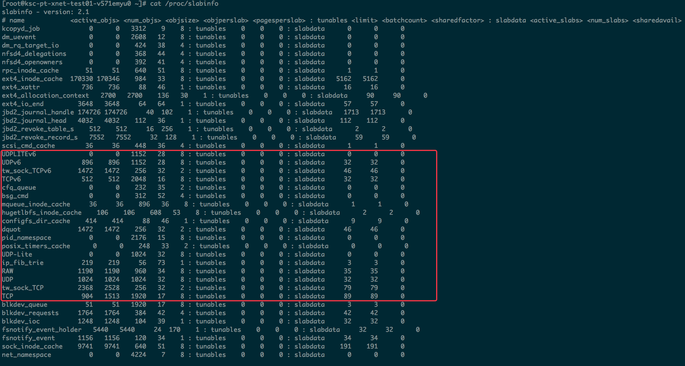
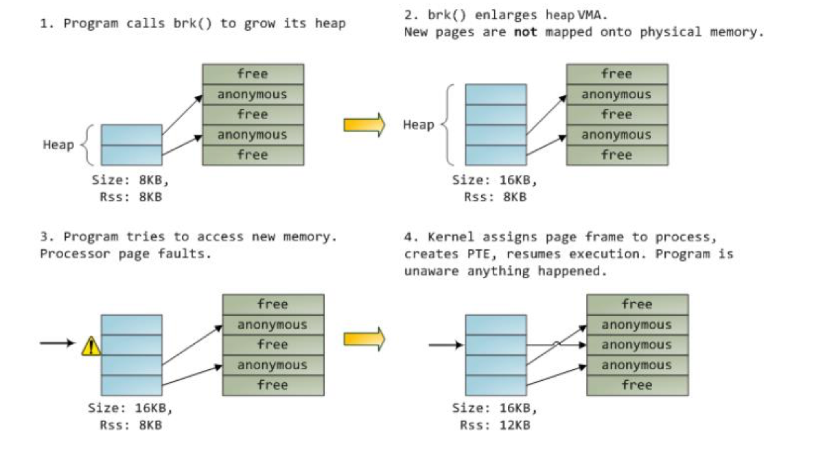
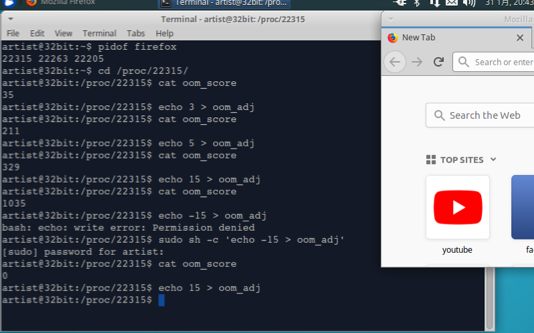

# Linux 内存管理

## 摘要
* slab、kmalloc/kfree、/proc/slabinfo和slabtop
* malloc/free、kmalloc/kfree与Buddy关系
* mallocopt
* vmalloc
* Linux lazy行为
* OOM(内存耗尽)、oom_score和oom_adj
* Android 进程生命周期与OOM


### Buddy算法问题
&emsp;&emsp;&emsp; 通过第一部分学习,咱们知道内存所有的ZONE都通过Buddy算法进行管理。在buddy算法中空闲物理内存会被分为11个组，其中第0,1，N个组分别对应2^0、2^n个连续物理界面。当需要申请的内存小于1页(4K),Buddy算法也会分配1页(4K)。此时再使用Buddy算法进行分配粒度太大了,对内存是一种极大的浪费。

* 


## Slab
&emsp;&emsp;&emsp; Buddy的最小单位是页(4k), 无论是内核还是用户程序都会申请一些更小的内存。所以在在Linux中对heap(堆)内存进行了二次管理,从Buddy拿到的内存(1K,4K,8K....)再次进行分割管理,这种就是Slab。


### slab原理
&emsp;&emsp;&emsp; 例如,申请8byte内存。Linux 内核首先会从Buddy申请到1页(4K)内存,然后将4K分成多个8byte,每一个8byte被称为Slab的一个object。
<br>
&emsp;&emsp;&emsp; Slab机制的实现算法有slab、slub、slob。每种算法的实现请参考[slab](imgs/slaballocators.pdf)。

&emsp;&emsp;&emsp; 备注: Slab英文"大块"的意思。就像在超市中买一大块牛肉,然后再进行切割,当牛肉被吃完后,还是需要去超市买一大块牛肉。Slab也是这样的原理,每次从Buddy申请一大块儿内存,然后分割成一个个object提供给内核或应用程序使用。

* 


### Linux slab使用
&emsp;&emsp;&emsp; Linux会针对一些小粒度内存的申请以及一些常规数据结构内存做slab,可以查看slab具体的分配情况(cat /proc/slabinfo):

* 


* 


<br>
&emsp;&emsp;&emsp; slab主要分为两类:

&emsp; &emsp; &emsp; 1. 第一类是内核里常用的数据结构,如TCPv6,UDPv6等。由于内核经常要申请和释放这类数据结构,所以就真对这些常用的数据结构分别做了slab,再次申请这类数据结构时就从所属的slab进行申请一个object(使用kmem_cache_alloc()函数申请)。
<br>
&emsp; &emsp; &emsp; 2. 第二类是一些小粒度的内存申请,如slabinfo中的kmalloc-16,kmalloc-32,kmalloc-64...(使用kmalloc申请)。

<br>
&emsp; &emsp; &emsp; 注意:不同数据类型申请内存时需要向当前所属数据类型的slab缓存进行申请,不能向其它数据类型slab缓存申请。而且slab只针对内核空间,跟用户空间没有关系。用户空间malloc/free 调用的libc库。

### Buddy 和Slab区别
&emsp; &emsp; &emsp; buddy将内存条当成一个池子进行管理(按页进行管理),slab从buddy拿到的内存当成一个池子进行管理。buddy和slab这两个都是内存分配器。slab管理的是来自Buddy的内存,而buddy管理的是Zone的内存。


### 用户态malloc/free、内核态kmalloc/kfree 与Buddy关系
&emsp; &emsp; &emsp; 所有的内存申请最终都来自于Buddy,但malloc/free和kmalloc/kfree都不是直接从Buddy申请和释放内存。而是从libc和slab二级分配器(由该二级分配器向Buddy申请和释放内存)申请和释放内存。
<br>
&emsp; &emsp; &emsp; slab和Buddy都是内存分配器,slab内存来自Buddy。slab和Buddy在算法级别上是对等的。
<br>
&emsp; &emsp; &emsp; malloc/free不是系统调用,它们是C语言libc库函数,与内核没有一一映射调用关系。malloc/free对内存操作真对的是libc(free()释放1M内存,并不会进行系统调用将内存还给buddy。malloc()也不会进行系统调用向buddy申请内存,可能会直接使用刚free掉的1M内存);同理,内核态kmalloc/kfree和Buddy不存在一一对应关系,而是从slab池操作。
<br>
*


### mallopt
&emsp; &emsp; &emsp; malloopt是libc库的函数,主要控制对二级内存分配器内存的控制。mallocopt可以控制libc把内存归还给内核的阈值。M_TRIM_THRESHOLD可以设置mmap收缩的阈值,默认值128K。当累计达到阈值时,free之后才将内存归还给内核M_TRIM_THRESHOLD的值必须设置为页大小对其,设置为-1会关闭内存收缩设置(libc库永远不会讲内存还给Linux内核)。

* 

&emsp; &emsp; &emsp; 如上程序调用mallopt函数,将M_TRIM_THRESHOLD设置为-1,表示内存用不收缩。虽然在接下来代码中free(buffer)掉100M内存,但是它也不会将libc内存归还给linux内核。则从/*\<do your RT-thing>\*/之后,再malloc和free都是在之前申请的100MB内存池进行操作,不会再和内存申请。这样可以使程序实时性提升,提高程序性能。这是一个在实时系统下的编程技巧。但在真实的项目中不建议这样使用,因为内存本身是紧缺资源,如果内存不尽兴收缩,其它进程内存使用有影响。

### Kmalloc Vs. vmalloc/ioremap

#### 内存空间
&emsp; &emsp; &emsp; 在对比kmalloc、vmalloc/ioremap之前,先来说说什么内存空间？内存空间并不是我们平时说的内存,平时我们所说的内存即内存条(主存)。内存空间不仅包括主存,它还包括寄存器、cpu缓存等。cpu在访问内存时都要经过: 虚拟地址-> MMU -> 物理地址 过程。

#### 页表理解
&emsp; &emsp; &emsp; 可以将页表理解成一个32位数组(IA32),其中高20位作为该数组的下标,低12位是偏移量。大家知道,虚拟通过高20位地址进行内存寻址。array[a]内存储就是物理地址(a就是高20位虚拟地址)。


#### Kmalloc、vmalloc/ioremap 内存申请

&emsp; &emsp; &emsp; 图中内存空间不同颜色的点都代表一页内存(buddy算法即是管理这些页的),无论是高端内存还是低端内存,都可以被kmalloc、vmalloc和用户空间的malloc申请。在一个也表中,几个不同的虚拟地址是可以对应一个相同的物理地址。
<br>
&emsp; &emsp; &emsp; 如上图所示,如果用户空间malloc申请了low memory zone白色圆圈内存,此时需要修改页表,标记用户空间2G虚拟地址映射到物理内存low memory zone 1页内存。当这一页4k物理内存被申请之后,kmalloc、vmalloc以及用户空间malloc都不能在申请这一页内存了。

#### kmalloc、vmalloc、malloc、ioremap 区别
&emsp; &emsp; &emsp; kmalloc和vmalloc分配的是内核的内存,malloc分配的事用户的内存。kmalloc保证分配的内存在物理上是连续的,vmalloc保证的是虚拟地址空间连续。
<br>
&emsp; &emsp; &emsp;  malloc、vmalloc申请内存需要修改页表,kmalloc申请内存时无需修改页表(kmalloc开机时虚拟内存已经和low memory进行了映射)。如果low memory zone内存被用户空间已经申请,此时也需要修改内核空间页表。一旦low memory zone内存被用户申请,内核空间就不能访问该内存。虽然不能被内核空间访问,但已经被low memory zone映射区映射(此时,该物理页被映射到两个虚拟地址)。
<br>


#### vmalloc
&emsp; &emsp; &emsp; 用于申请较大的内存空间,虚拟内存时连续的,物理内存不连续。一般情况下,只有硬件设备才需要物理地址连续的内存。因为硬件设备往往存在于MMU之外,根本不了解虚拟地址;但为了性能考虑,内核中一般使用kmalloc(),而只有在需要得大块儿内存时才使用vmalloc(),例如当模块被动态加载到内核当中时,就把模块装载到由vmalloc()分配的内存上。

* /linux-4.16-rc4/mm/vmalloc.c

```bash
/**
 *      vmalloc  -  allocate virtually contiguous memory
 *      @size:          allocation size
 *      Allocate enough pages to cover @size from the page level
 *      allocator and map them into contiguous kernel virtual space.
 *
 *      For tight control over page level allocator and protection flags
 *      use __vmalloc() instead.
 */
void *vmalloc(unsigned long size)
{
        return __vmalloc_node_flags(size, NUMA_NO_NODE,
                                    GFP_KERNEL);
}
EXPORT_SYMBOL(vmalloc);
```
<br>
&emsp; &emsp; &emsp; vmalloc一般申请比较大内存,并且对物理内存连续性没有要求的情况下使用。vmalloc一般分配的内存比较大,直接从buddy拿,没必要从slab拿;而kmalloc从slab分配器拿内存(如果分配内存>128K,则直接从Buddy拿内存。128K需要进一步确认!)。
<br>
&emsp; &emsp; &emsp; 寄存器是通过ioremap往vmalloc区域映射的。当调用ioremap时,需要更改页表,将vmalloc映射区虚拟地址和寄存器物理地址进行映射。
<br>
&emsp; &emsp; &emsp; 通过查看/proc/vmallocinfo可以看到ioremap申请的内存,被映射到vmalloc区域。

* 


#### 分配和映射区别
&emsp; &emsp; &emsp; 内存分配则表示内存被划分掉了,其它虚拟地址不能再映射到该地址;映射则表示虚拟地址通过MMU将物理地址产生映射关系,但页内存还是可以被其它虚拟地址分配掉。

### 内存分配Lazy行为
&emsp; &emsp; &emsp; Linux系统总是以最懒惰的行为为应用程序分配内存,当调用malloc()函数申请内存后,并没有真正申请成功。之后当发生写操作时操作系统才会给你真正的分配内存。
&emsp; &emsp; &emsp; 例如,在用户空间申请100M内存时,并没有真的申请成功,只有100M内存中的任意一页被写的时候才真的成功;用户空间申请100M内存时,Linux内核将这100M内存中的每一个4K都以只读的形式映射到一个全部清零的页面(其实不太符合heap的定义,heap一般都是可读可写的),当任意一个4K被写的时候即发生page fault(注意以页为单位发生page fault),Linux 内核收到缺页中断后就可以从硬件寄存器中读取到缺页中断的地址和发生的原因。之后Linux内核根据缺页中断报告的虚拟地址和原因分析出是用户程序在写malloc的合法区域。此时,Linux内核会从内存中申请一页内存,执行copy to write,把全部清零的页面重新拷贝给新申请的页面。然后把进程的PTE(页表项)的虚拟地址指向一个新的物理地址。同时,页表中这一页地址的权限页修改为R+W的。

* 


&emsp; &emsp; &emsp;  图中第一步,heap初始化为8K并且写入8k,所以RSS为8K;第二步调用brk扩展heap为16K,此时VSS变为16K,但RSS仍然是8K;第三步,写heap的第三页发生Page fault;第四步,写时拷贝,RSS变成12K。依次类推,写第四步成功后RSS才会变成16K。
<br><br>

&emsp; &emsp; &emsp; 注: Lazy机制可以理解为"欺骗应用程序"。但在内核空间调用kmalloc是不欺骗的,要么分配成功,要么分配失败。


### OOM
&emsp; &emsp; &emsp; Linux在运行时会对每一个进程进行Out of Memory打分(进程耗费越高,Score分数越高)。可以通过/proc／pid/oom_score查看每个进程的score分数。一旦内存耗尽,Linux内核会Kill掉当前oom_score分值最高的进程。

* 
[](https://asciinema.org/a/9yiKlmm7anssbvt2nUY14pazy)

<br>
&emsp; &emsp; &emsp; 如上实例,swapoff -a 将交换分区关闭,并配置overcommit_memory 为1(允许应用程序申请很大内存,而内核不再去评估系统当前有多少内存可用。)。sudo sh -c 'echo 1 > /proc/sys/vm/overcommit_memory'(echo 不会启动一个新的进程,所以加sh -c,在新的shell中执行,这样做sudo才有效)。可以发现在运行一段时间后此程序被杀死。

#### OOM打分因子
&emsp; &emsp; &emsp; OOM打分还会看一些其它的因子,如下图所示:


#### OOM实例
&emsp; &emsp; &emsp; 如下实例,启动一个进程firefox,同样关闭swap分区并配置overcommit_memory为1,然后将firefox的oom_score调到最高,然后运行如上实例,观察那个进程先被Kill。

* 


<br>
&emsp; &emsp; &emsp; 如图所示,写入oom_adj的数值越大,导致oom_score的打分越高,越容易被kill,此时写入不需要root权限,但想使其打分值改小则需要root权限,这也是符合现实意义了。如上实例进程运行发现,由于firefox的oom_score更高,所以先被kill,但一段时间过后再次发生Out of memory,test进程也被kill。


### End.