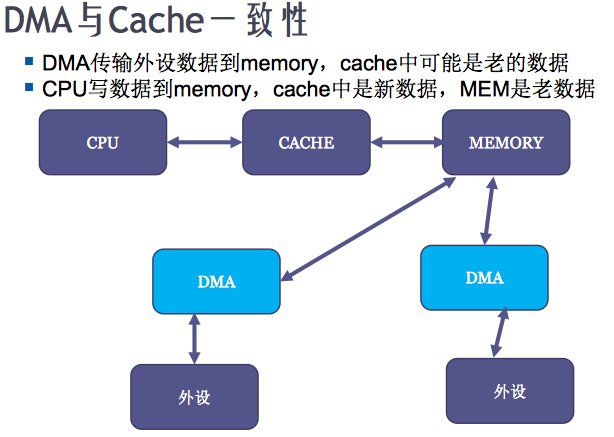
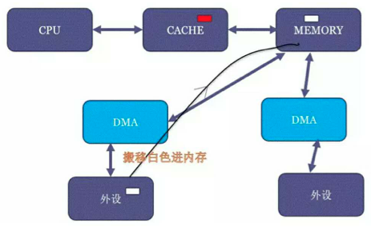
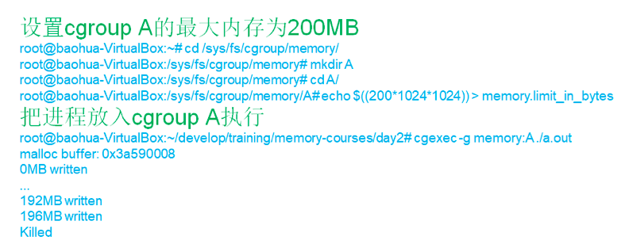

# 内存管理-其它工程问题以及调优

## 摘要
* DMA和Cache一致性
* 内存的Cgroup
* 性能方面的调优: page in/out,swapin/out
* Dirty ratio的一些设置
* swappiness


## DMA与Cache一致性
&emsp;&emsp;&emsp; 通过之前内存管理学习咱们知道,CPU需要访问内存首选需要通过MMU,然后进行数据操作。而DMA传输外设数据到内存,直接可以操作内存指定Zone,不需要通过MMU。
<br>
&emsp;&emsp;&emsp; 通过CPU从内存读数据时,首先检查Cpu cache中是否有缓存,如果有缓存,则直接从缓存中拿数据返回,不再请求内存(这样会提升性能);当CPU将数据写入到内存时,先写入到cpu Cache,然后再同步到主存(因为写到cache就返回了,所以性能会提升)。



### CPU写机制:Write-through与Write-back
* Write through

&emsp;&emsp;&emsp; CPU向cache写入数据时,同时向内存(后端存储)也写一份,使cache和memory的数据保持一致。优点是简单,缺点是每次都要访问memory,速度比较慢。
<br>

* Post write

&emsp;&emsp;&emsp; CPU更新cache数据时,把更新的数据写入到一个更新缓冲器,在合适的时候才对memory(后端存储)进行更新。这样可以提高cache访问速度。但是,在数据连续被更新两次以上的时候,缓冲区将不够实用，被迫同时更新memory(后端存储)。
<br>

* Write back

&emsp;&emsp;&emsp; CPU更新Cache时,只是把更新的Cache区标记一下,并不同步更新memory(后端存储)。只有在cache区要被新进入的数据替代时,才更新memory(后端存储)。这样做的原因是,考虑到很多时候cache存入的是中间结果,没有必要同步更新memory(后端存储)。优点是CPU执行的效率提高,缺点是实现起来比较复杂。


### CPU cache一致性问题




&emsp;&emsp;&emsp; 在上图1种,cpu去读内存,当从内存中读到内容之后会缓存在cpu Cache一份(图1,在cache 和memory中红色位置)。此时,如果图2中的DMA外设将一个白色内容搬移了内存原来红色的位置。这样当下一次再通过CPU读取原来内存中红色区域内容时,由于cpu cache中该数据已经存在,所以读取的内容还是上次缓存的数据。但是在内存中该区域的数据已经发生改变,所以此时就会存在缓存一致性问题。


### DMA Cache一致性解决方案

#### Coherent DMA buffers(一致性DMA缓冲区)
<br>
&emsp;&emsp; 驱动DMA开发时需要手工申请内存,可以对申请的内存进行重新映射(一般被映射到vmalloc area,然后将虚拟地址和物理地址的映射设置为不带cache),在页表PTE标记不带cache。
<br>
&emsp;&emsp; 调用dma_alloc_coherent函数,返回的虚拟地址。在页表页内映射的物理地址标记为uncache。dma_alloc_coherent函数最终会调用*__alloc_from_contiguous函数。

```c
static void *__alloc_from_contiguous(struct device *dev, size_t size,
                                     pgprot_t prot, struct page **ret_page,
                                     const void *caller, bool want_vaddr,
                                     int coherent_flag, gfp_t gfp)
{
        unsigned long order = get_order(size);
        size_t count = size >> PAGE_SHIFT;
        struct page *page;
        void *ptr = NULL;

        page = dma_alloc_from_contiguous(dev, count, order, gfp);
        if (!page)
                return NULL;

        __dma_clear_buffer(page, size, coherent_flag);

        if (!want_vaddr)
                goto out;

        if (PageHighMem(page)) {
                ptr = __dma_alloc_remap(page, size, GFP_KERNEL, prot, caller);
                if (!ptr) {
                        dma_release_from_contiguous(dev, page, count);
                        return NULL;
                }
        } else {
                __dma_remap(page, size, prot);
                ptr = page_address(page);
        }

 out:
        *ret_page = page;
        return ptr;
}
```

&emsp;&emsp;&emsp;&emsp; 以上是常规SOC的做法,现在一些SOC特别强。有一些SoC里面可以用硬件做CPU和外设的cache coherence(通过硬件和CPU进行交互,由硬件进行维护Cache同步问题),下图是SOC cache coherent interconnect:


&emsp;&emsp;&emsp;&emsp; 这些SoC的厂商就可以把内核的通用实现overwrite掉,变成dma_alloc_coherent()申请的内存也是可以带cache的(自己重新实现了dma_alloc_coherent)。

##### IOMMU
&emsp;&emsp;&emsp;&emsp; 如果DMA引擎上存在IOMMU,那么dma_alloc_coherent就不需要通过vmalloc()函数申请连续的内存了。可以通过IOMMU进行虚拟地址和物理地址映射。


<br>
&emsp;&emsp;&emsp;&emsp; 当硬件上有了IOMMU,就可以随意拿不连续的内存。linux 内核知道这些物理页的位置(页可以是反着的),然后由SOC IOMMU驱动将这些不连续物理内存和页表(和cpu 页表一样的虚拟地址)内的虚拟地址进行映射。最后DMA引擎就可以使用这些连续的虚拟地址。

<br>
注意: dma_alloc_coherent只是一个前端,具体从什么位置申请内存,需要根据当前DMA引擎和CPU型号、芯片是否有IOMMU等条件有关系,最终是由驱动决定的。


* DMA Streaming Mapping(流式DMA映射)
<br>
&emsp;&emsp; DMA Streaming Mapping API适合在写驱动时候,用作DMA的内存不是由自己分配的。而是由上层分配的(tcp/ip协议栈、文件系统)。每次操作之前,需要调用dma_map_single()。该函数有一个参数,该参数有一个flag,告诉内核是从内存到外设数据传输,当设置该flag之后再调用dma_map_single()时,会将cache flush(保证数据传输的是最新数据)。同样在调用dma_map_single()函数时,如果将flag标记为从外设向内存传输数据时,内核会强制进行cache invalidation操作(将外设数据刷到内存,保证数据是最新的)。
<br>
&emsp;&emsp; 一旦调用dma_map_single()之后,cpu就不能再对该区域内存进行任何操作(因为它做了cache flush操作),直到调用dma_unmap_single()之后才可以对该内存进行操作。


## Memory Cgroup
&emsp;&emsp; 在Linux读写文件时,它用于缓存文件的逻辑内容,从而加快对磁盘上映像和数据的访问。



&emsp;&emsp; 创建一个memory cgroup,将swappiness设置为0。那么这个cgroup的匿名页就无法进行交换了。此时将一个进程加入到该cgroup,那么这个进程就常驻在内存,不会被swap到匿名文件或分区。memory cgroup也可以限制使用内存大小,如果设置内存大小为1024M,那么当进程使用内存超过1024M,那么进程就会被OOM(out of memory)。


## 文件Dirty数据的写回
&emsp;&emsp; Linux中Dirty数据要定期进行写回操作。如果Dirty数据在内存待太久,机器突然掉电数据会丢失。而且会给后面磁盘操作产生问题。
<br>
&emsp;&emsp; Linux有一个控制Dirty脏页写回机制。主要通过时间和比例控制脏页写回频率。

### dirty_expire_centisecs 和 dirty_writeback_centisecs
&emsp;&emsp; dirty_expire_centisecs标记当Dirty数据满足kernel flusher线程的阈值时就会达到写入的要求(它以百分之一秒表示)。在内存中的Dirty数据超过此时间间隔的数据,将在下一次flusher线程被唤醒时数据被写出。
<br>
&emsp;&emsp; 内核flusher线程(dirty_writeback_centisecs)会周期被唤醒,将旧数据写入磁盘。如果将dirty_writeback_centisecs设置为0,则仅用周期性回写。


