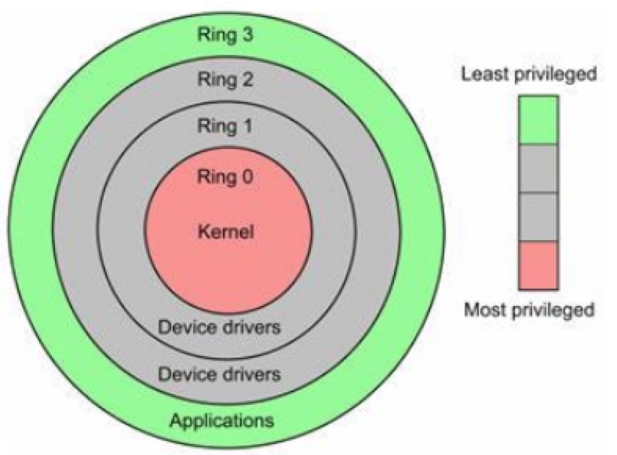
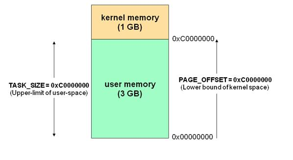
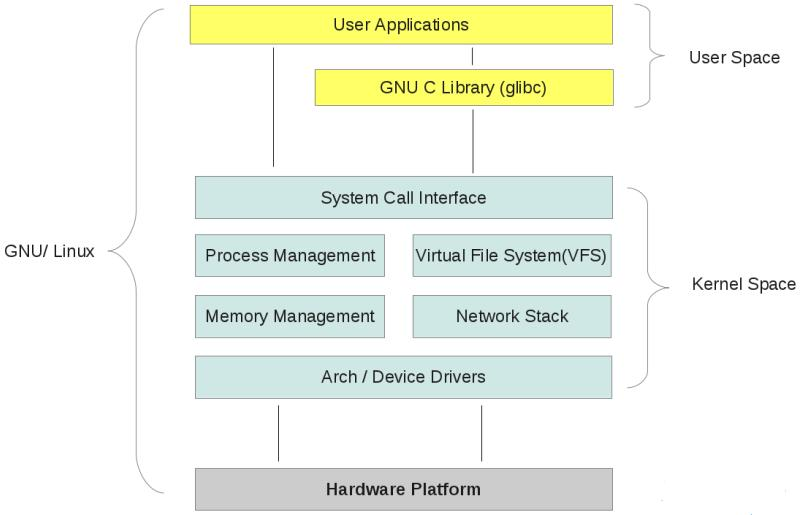

## Linux 进程管理(IA32平台)

### Linux 特权级

Intel x86架构的cpu一共有0~4个特权级,0最高级,3最低级。ARM架构也有不同的特权级别,硬件上在执行每条指令时都会对指令所具有的特权级做相应的检查。硬件已经提供了一套特权级使用的相关机制,软件自然就好好利用，这属于操作系统做的事情。

对于UNIX/LINUX来说,只使用了0级特权级别和3级特权级别。也就是说在UNIX/LINUX系统中,一条工作在0级特权级的指令具有了CPU能提供的最高权力,而一条工作在3级特权的指令具有CPU提供饿最低或者最基本权利。



以上是从CPU执行命令角度理解特权,其实虚拟地址到物理地址有MMU硬件实现。即分页机制是硬件对分页的支持,进程中有页表数据结构指向用户空间和内核空间,给用户态和内核态访问内存空间不同。


### 用户态和内核态

#### 内核态
Linux中每个进程有两个stack,分别用于用户态和内核态的进程执行。其中的内核态就是用于内核态stack,它和进程的task_struct结构(更具体的讲thread_info结构)一起放在两个连续的页框大小的空间内。


#### 用户态
现在从特权级的调度来理解用户态和内核态就比较好理解,当程序运行在3级特权级上时,就可以称之为运行在用户态,因为这是最低特权级，是普通的用户进程运行的特权级，大部分用户直接面对的程序都是运行在用户态。反之,当程序运行在0级特权级上时，就可以称之为运行在内核态。


#### 用户态Vs.内核态
虽然用户态下和内核态下工作的程序有很多差别，但最重要的差别就在于特权级的不同，即权力的不同。运行在用户态的程序不能访问操作系统内核数据结构和程序。当我们在系统中执行一个程序时，大部分时间是运行在用户态下的。在其需要操作系统帮助完成某些它没有权力和能力完成的工作时就会切换到内核态。


Linux进程的4GB(IA32平台)地址空间(VA),3G-4G部分大家是共享的，是内核态的地址空间，这里存放着整个内核的代码和所有的内核模块，以及内核所维护的数据。

用户运行一个程序，该程序所创建的进程开始是运行在用户态的，如果要执行文件操作，网络数据发送等操作，必须通过write，send等系统调用，这些系统调用会调用内核中的代码来完成操作，这时，必须切换到Ring0，然后进入3GB-4GB中的内核地址空间去执行这些代码完成操作，完成后，切换回Ring3，回到用户态。这样，用户态的程序就不能随意操作内核地址空间，具有一定的安全保护作用。 

#### 保护模式
通过内存页表操作等机制，保证进程间的地址空间不会互相冲突，一个进程的操作不会修改另一个进程的地址空间中的数据。在内核态下，CPU可执行任何指令，在用户态下CPU只能执行非特权指令。当CPU处于内核态，可以随意进入用户态；而当CPU处于用户态，只能通过```中断的方式```进入内核态。一般程序一开始都是运行于用户态，当程序需要使用系统资源时，就必须通过调用软中断进入内核态。

#### CPU运行状态
CPU总处于一下状态中的一种:

* 内核态: 运行于进程上下文,内核代表进程运行于内核空间。
* 内核态: 运行于中断上下文,内核代表硬件运行于内核空间。
* 用户态: 运行于用户空间。

#### 用户态和内核态的转换
用户态切换到内核态的3中方式:

* 系统调用: 这是用户态进程主动要求切换到内核态的一种方式，用户态进程通过系统调用申请使用操作系统提供的服务程序完成工作。而系统调用的机制，其核心还是使用了操作系统为用户特别开放的一个中断来实现。例如IX86的int 80h; PowerPC的sc。

* 异常:当CPU在执行运行在用户态下的程序时，发生了某些事先不可知的异常，这时会触发由当前运行进程切换到处理此异常的内核相关的程序中，也就是转到了内核态，比如缺页异常。 

* 外围设备的中断: 当外围设备完成用户请求的操作后，会向CPU发出相应的中断信号，这时CPU会暂停执行下一条即将要执行的指令转而去执行与中断信号对应的处理程序，如果先前执行的指令是用户态下的程序，那么这个转换的过程自然也就发生了由用户态到内核态的切换。比如硬盘读写操作的完成，系统会切换到硬盘读写的中断处理程序中执行后续操作等。

这3种方式是系统在运行时,由用户态转到内核态的最主要方式,其中系统调用可以认为是用户进程主动发起的,异常和外围中断是被动的。

#### 具体的切换操作
从触发方式上看，可以认为纯在前述3种不同的类型，但是从最终实际完成由用户态到内核态的切换操作上来说，涉及的关键步骤是完全一致的，没有任何区别。都相当于执行了一个中断响应的过程，因为系统调用实际上最终是中断机制实现的，而异常和中断的处理机制基本上也是一致的。关于中断处理机制的细节和步骤这里不做过多分析，涉及到有用户态切换到内核态的步骤主要包括：

* 从当前进程的描述符中提取其内核栈的ss0及esp0信息。
* 使用ss0和esp0指向的内核栈将当前进程的cs, eip, eflags, ss, esp信息保存起来，这个过程也完成了由用户栈到内核栈的切换过程，同时保存了被暂停执行的程序的下一条指令。
* 将先前中断向量检索得到的中断处理程序的cs，eip信息装入相应的寄存器，开始执行中断处理程序，这时就转到内核态的程序执行了。


### 上下文及中断上下文
内核空间和拥护空间是操作系统重要的理论知识,用户程序运行在用户空间,内核功能模式运行在内核空间,两者空间是不能互相访问的,```内核空间和用户空间指其代码和数据存放在内存空间```。用户态程序要访问内核空间,须使用系统调用。当用户空间的应用程序通过系统调用进入内核空间时,就会涉及到上下文的切换。```用户空间和内核空间具有不同的地址映射、通用寄存器和专用寄存器组以及堆栈区，```而且用户空间的进程要传递很多变量、参数给内核，内核也要保存用户进程的一些寄存器、变量等，以便系统调用结束后回到用户空间继续执行。

所谓的进程上下文，就是一个进程传递给内核的那些参数和CPU的所有寄存器的值、进程的状态以及堆栈中的内容，也就是进程在进入内核态之前的运行环境。所以在切换到内核态时需要保存当前进程的所有状态，即保存当前进程的上下文，以便再次执行该进程时，能够恢复切换时的状态，继续执行。同理，硬件通过触发信号，导致内核调用中断处理程序，进入内核空间。这个过程中，硬件的一些变量和参数也要传递给内核，内核通过这些参数进行中断处理，中断上下文就可以理解为硬件传递过来的这些参数和内核需要保存的一些环境（主要是被中断的进程的环境）。

``` 当一个进程在执行时,CPU的所有寄存器中的值、进程的状态以及堆栈中的内容被称为该进程的上下文。```当内核需要切换到另一个进程时，它需要保存当前进程的所有状态，即保存当前进程的上下文，以便在再次执行该进程时，能够必得到切换时的状态执行下去。在LINUX中，当前进程上下文均保存在进程的任务数据结构中。在发生中断时,内核就在被中断进程的上下文中，在内核态下执行中断服务例程。但同时会保留所有需要用到的资源，以便中继服务结束时能恢复被中断进程的执行。

上下文简单说来就是一个环境，相对于进程而言，就是进程执行时的环境。相对于中断而言就是中断执行时的环境。 

一个进程的上下文可以分为三个部分:```用户级上下文、寄存器上下文以及系统级上下文```。

* 用户级上下文: 正文、数据、用户堆栈以及共享存储区。
* 寄存器上下文: 通用寄存器、程序寄存器(IP)、处理器状态寄存器(EFLAGS)、栈指针(ESP)。
* 系统级上下文: 进程控制块task_struct、内存管理信息(mm_struct、vm_area_struct、pgd、pte)、内核栈。 

进程上下文切换分为```进程调度时和系统调用时两种切换,消耗资源不同。```当发生进程调度时，进行进程切换就是上下文切换(context switch).操作系统必须对上面提到的全部信息进行切换，新调度的进程才能运行。而系统调用进行的模式切换(mode switch)与进程切换比较起来，容易很多，而且节省时间，因为模式切换最主要的任务只是切换进程寄存器上下文的切换。在进程上下文中，可以用current宏关联当前进程，也可以睡眠，也可以调用调度程序。

中断上下文不支持抢占，运行在进程上下文的内核代码是可以被抢占的（Linux2.6支持抢占），就是支持进程调度。但是一个中断上下文，通常都会始终占有CPU（当然中断可以嵌套，但我们一般不这样做），不可以被打断。正因为如此，运行在中断上下文的代码就要受一些限制，不能做下面的事情:

* 睡眠或者放弃CPU: 这样做的后果是灾难性的，因为内核在进入中断之前会关闭进程调度，一旦睡眠或者放弃CPU，这时内核无法调度别的进程来执行，系统就会死掉。
* 尝试获得信号量、执行自旋锁:如果获得不到信号量，代码就会睡眠，会产生和上面相同的情况。
* 访问用户空间的虚拟地址: 因为中断上下文是和特定进程无关的，它是内核代表硬件运行在内核空间，所以在中断上下文无法访问用户空间的虚拟地址。

### 用户空间和内核空间
现在操作系统都是采用虚拟存储器，那么对32位操作系统而言，它的寻址空间(虚拟存储空间)为4G(2的32次方)。操作系统的核心是内核,独立于普通的用户程序,可以访问受保护的内存空间,也可以访问底层硬件设备的所有权限。为了保证用户进程不能直接操作内核,保证内核的安全,操作系统将虚拟空间划为两部分。

一部分为内核空间,一部分为用户空间。针对linux操作系统而言，将最高的1G字节(从虚拟地址0xC0000000到0xFFFFFFFF),供内核使用,称为内核空间。

将较低的3G字节(从虚拟地址0x00000000到0xBFFFFFFF)，供各个进程使用，称为用户空间。每个进程可以通过系统调用进入内核，因此，Linux内核由系统内的所有进程共享。于是，从具体进程的角度来看，每个进程可以拥有4G字节的虚拟空间。空间分配如下图所示:




#### Linux 内部结构
整个linux内部结构可以分为三部分,从最底层到最上层依次是：硬件-->内核空间-->用户空间。如下图所示:



* 内核空间中存放的是内核代码和数据,而进程的用户空间中存放的是用户程序和数据。不管是内核空间还是用户空间,它们都处于虚拟内存空间中。
* Linux使用两级保护机制: 0级供内核使用, 3级供用户程序使用。

#### 为什么不把所有地址空间都分配给内核
若把所有地址空间都给内存，那么用户进程怎么使用内存？怎么保证内核使用内存和用户进程不起冲突？

可以忽略Linux对段式内存映射的支持。 在保护模式下，我们知道无论CPU运行于用户态还是核心态，CPU执行程序所访问的地址都是虚拟地址，MMU 必须通过读取控制寄存器CR3中的值作为当前页面目录的指针，进而根据分页内存映射机制（参看相关文档）将该虚拟地址转换为真正的物理地址才能让CPU真 正的访问到物理地址。

对于32位的Linux，其每一个进程都有4G的寻址空间，但当一个进程访问其虚拟内存空间中的某个地址时又是怎样实现不与其它进程的虚拟空间混淆 的呢？每个进程都有其自身的页面目录PGD，Linux将该目录的指针存放在与进程对应的内存结构task_struct.(struct mm_struct)mm->pgd中。每当一个进程被调度(schedule())即将进入运行态时，Linux内核都要用该进程的PGD指针设 置CR3(switch_mm())。

当创建一个新的进程时，都要为新进程创建一个新的页面目录PGD，并从内核的页面目录swapper_pg_dir中复制内核区间页面目录项至新建进程页面目录PGD的相应位置，具体过程如下：
do_fork() --> copy_mm() --> mm_init() --> pgd_alloc() --> set_pgd_fast() --> get_pgd_slow() --> memcpy(&PGD + USER_PTRS_PER_PGD, swapper_pg_dir + USER_PTRS_PER_PGD, (PTRS_PER_PGD - USER_PTRS_PER_PGD) * sizeof(pgd_t)) 这样一来, 每个进程的页面目录就分成了两部分, 第一部分为“用户空间”, 用来映射其整个进程空间（0x0000 0000－0xBFFF FFFF）即3G字节的虚拟地址; 第二部分为“系统空间”,用来映射(0xC000 0000－0xFFFF FFFF)1G字节的虚拟地址。```可以看出Linux系统中每个进程的页面目录的第二部分是相同的，所以从进程的角度来看，每个进程有4G字节的虚拟空间， 较低的3G字节是自己的用户空间，最高的1G字节则为与所有进程以及内核共享的系统空间。```


### 实例

进程A中通过系统调用sethostname(const char *name,seze_t len)设置计算机在网络中的"主机名"。该情景中我们势必涉及到从用户空间向内核空间传递数据的问题，name是用户空间中的地址，它要通过系统调用设置到内核中的某个地址中。

#### 具体细节
系统调用的具体实现是将系统调用的参数依次存入寄存器ebx,ecx,edx,esi,edi(最多5个参数,该情景有两个 name和len),接着将系统调用号存入寄存器eax, 然后通过中断指令“int 80”使进程A进入系统空间。

由于进程的CPU运行级别小于等于为系统调用设置的陷阱门的准入级别3，所以可以畅通无阻的进入系统空间去执行为int 80设置的函数指针system_call()。由于system_call()属于内核空间，其运行级别DPL为0，CPU要将堆栈切换到内核堆栈，即进程A的系统空间堆栈。我们知道内核为新建进程创建task_struct结构时，共分配了两个连续的页面，即8K的大小，并将底部约1k的大小用于task_struct(如#define alloc_task_struct() ((struct task_struct *) __get_free_pages(GFP_KERNEL,1))),而其余部分内存用于系统空间的堆栈空间，即当从用户空间转入系统空间时，堆栈指针 esp变成了（alloc_task_struct()+8192），这也是为什么系统空间通常用宏定义current获取当前进程的task_struct地址的原因。

每次在进程从用户空间进入系统空间之初, 系统堆栈就已经被依次压入用户堆栈SS、用户堆栈指针ESP、EFLAGS、 用户空间CS、EIP, 接着system_call()将eax压入，再接着调用SAVE_ALL依次压入ES、DS、EAX、EBP、EDI、ESI、 EDX、ECX、EBX，然后调用sys_call_table+4*%EAX，本情景为sys_sethostname()。


#### copy_from_user(to, from, n)
在sys_sethostname()中,经过一些保护考虑后, 调用copy_from_user(to,from,n), 其中to指向内核空间 system_utsname.nodename,譬如0xE625A000, from指向用户空间譬如0x8010FE00。现在进程A进入了内核，在系统空间中运行, MMU根据其PGD将虚拟地址完成到物理地址的映射, 最终完成从用户空间到系统空间数据的复制。准备复制之前内核先要确定用户空间地址和长度的合法性, 至于从该用户空间地址开始的某个长度的整个区间是否已经映射并不去检查, 如果区间内某个地址未映射或读写权限等问题出现时, 则视为坏地址, 就产生一个页面异常, 让页面异常服务程序处理.

具体过程: copy_from_user()->generic_copy_from_user()->access_ok()+__copy_user_zeroing()。


### 总结

* IA32系统中,进程寻址空间0~4G。
* 进程在用户态只能访问0~3G, 只有进入内核态才能访问3~4G。
* 进程通过系统调用进入内核态。
* 每个进程虚拟空间的3G~4G部分是相同的。
* 进程从用户态进入内核态不会引起CR3的改变,但会引起堆栈的改变。


