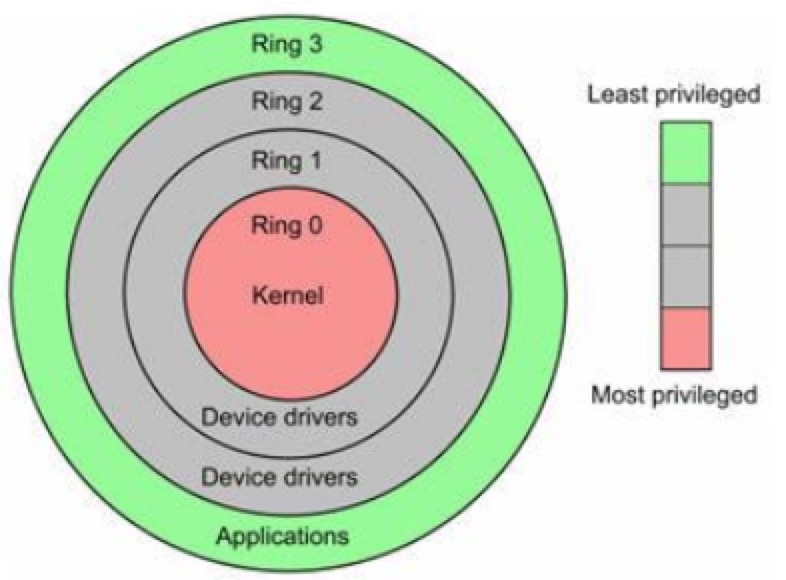

## Linux 进程管理

### Linux 特权级

Intel x86架构的cpu一共有0~4个特权级,0最高级,3最低级。ARM架构也有不同的特权级别,硬件上在执行每条指令时都会对指令所具有的特权级做相应的检查。硬件已经提供了一套特权级使用的相关机制,软件自然就好好利用，这属于操作系统做的事情。

对于UNIX/LINUX来说,只使用了0级特权级别和3级特权级别。也就是说在UNIX/LINUX系统中,一条工作在0级特权级的指令具有了CPU能提供的最高权力,而一条工作在3级特权的指令具有CPU提供饿最低或者最基本权利。



以上是从CPU执行命令角度理解特权,其实虚拟地址到物理地址有MMU硬件实现。即分页机制是硬件对分页的支持,进程中有页表数据结构指向用户空间和内核空间,给用户态和内核态访问内存空间不同。


### 用户态和内核态

#### 内核态
Linux中每个进程有两个stack,分别用于用户态和内核态的进程执行。其中的内核态就是用于内核态stack,它和进程的task_struct结构(更具体的讲thread_info结构)一起放在两个连续的页框大小的空间内。


#### 用户态
现在从特权级的调度来理解用户态和内核态就比较好理解,当程序运行在3级特权级上时,就可以称之为运行在用户态,因为这是最低特权级，是普通的用户进程运行的特权级，大部分用户直接面对的程序都是运行在用户态。反之,当程序运行在0级特权级上时，就可以称之为运行在内核态。


#### 用户态Vs.内核态
虽然用户态下和内核态下工作的程序有很多差别，但最重要的差别就在于特权级的不同，即权力的不同。运行在用户态的程序不能访问操作系统内核数据结构和程序。当我们在系统中执行一个程序时，大部分时间是运行在用户态下的。在其需要操作系统帮助完成某些它没有权力和能力完成的工作时就会切换到内核态。


Linux进程的4GB(IA32平台)地址空间(VA),3G-4G部分大家是共享的，是内核态的地址空间，这里存放着整个内核的代码和所有的内核模块，以及内核所维护的数据。

用户运行一个程序，该程序所创建的进程开始是运行在用户态的，如果要执行文件操作，网络数据发送等操作，必须通过write，send等系统调用，这些系统调用会调用内核中的代码来完成操作，这时，必须切换到Ring0，然后进入3GB-4GB中的内核地址空间去执行这些代码完成操作，完成后，切换回Ring3，回到用户态。这样，用户态的程序就不能随意操作内核地址空间，具有一定的安全保护作用。 

#### 保护模式
通过内存页表操作等机制，保证进程间的地址空间不会互相冲突，一个进程的操作不会修改另一个进程的地址空间中的数据。在内核态下，CPU可执行任何指令，在用户态下CPU只能执行非特权指令。当CPU处于内核态，可以随意进入用户态；而当CPU处于用户态，只能通过```中断的方式```进入内核态。一般程序一开始都是运行于用户态，当程序需要使用系统资源时，就必须通过调用软中断进入内核态。

#### CPU运行状态
CPU总处于一下状态中的一种:

* 内核态: 运行于进程上下文,内核代表进程运行于内核空间。
* 内核态: 运行于中断上下文,内核代表硬件运行于内核空间。
* 用户态: 运行于用户空间。

#### 用户态和内核态的转换
用户态切换到内核态的3中方式:

* 系统调用: 这是用户态进程主动要求切换到内核态的一种方式，用户态进程通过系统调用申请使用操作系统提供的服务程序完成工作。而系统调用的机制，其核心还是使用了操作系统为用户特别开放的一个中断来实现。例如IX86的int 80h; PowerPC的sc。

* 异常:当CPU在执行运行在用户态下的程序时，发生了某些事先不可知的异常，这时会触发由当前运行进程切换到处理此异常的内核相关的程序中，也就是转到了内核态，比如缺页异常。 

* 外围设备的中断: 当外围设备完成用户请求的操作后，会向CPU发出相应的中断信号，这时CPU会暂停执行下一条即将要执行的指令转而去执行与中断信号对应的处理程序，如果先前执行的指令是用户态下的程序，那么这个转换的过程自然也就发生了由用户态到内核态的切换。比如硬盘读写操作的完成，系统会切换到硬盘读写的中断处理程序中执行后续操作等。

这3种方式是系统在运行时,由用户态转到内核态的最主要方式,其中系统调用可以认为是用户进程主动发起的,异常和外围中断是被动的。

#### 具体的切换操作
从触发方式上看，可以认为纯在前述3种不同的类型，但是从最终实际完成由用户态到内核态的切换操作上来说，涉及的关键步骤是完全一致的，没有任何区别。都相当于执行了一个中断响应的过程，因为系统调用实际上最终是中断机制实现的，而异常和中断的处理机制基本上也是一致的。关于中断处理机制的细节和步骤这里不做过多分析，涉及到有用户态切换到内核态的步骤主要包括：

* 从当前进程的描述符中提取其内核栈的ss0及esp0信息。
* 使用ss0和esp0指向的内核栈将当前进程的cs, eip, eflags, ss, esp信息保存起来，这个过程也完成了由用户栈到内核栈的切换过程，同时保存了被暂停执行的程序的下一条指令。
* 将先前中断向量检索得到的中断处理程序的cs，eip信息装入相应的寄存器，开始执行中断处理程序，这时就转到内核态的程序执行了。 


